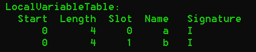

# Core API（Event Based API）

## 1 Class相关API

### 1.1 关于Compiled Class的基础知识

#### 1.1.1 Complied Class的结构

**三种Section**

- 用于描述类（Class）的Section，包含类的：

  - 修饰符 - Modifier
  - 类名 - Name
  - 父类 - Super Class
  - （实现的）接口 - Interface
  - 注解 - Annotation

- 用于描述类中成员变量（Field）的Section，一个成员变量对应一个这样的Section，包含成员变量的：

  - 修饰符 - Modifier
  - 变量名 - Name
  - 类型 - Type
  - 注解 - Annotation 

- 用于描述类中方法和构造器的（Method and Constructor）的Section，一个方法/构造器对应一个这样的Section，包含方法或构造器的：

  - 修饰符 - Modifier

  - 方法名 - Name

  - 返回类型 - Return Type

  - 参数类型 - Parameter Type

  - 注解 - Annotation

  - 方法的内容（通常以以编译后的形式——一个Java字节码序列的形式出现）

    > **It also contains the compiled code of the method, in the form of a sequence of Java bytecode instructions.**  

#### 1.1.2 编译后的类（Complied Class）记录的信息

- 一个.class仅包含一个类，而一个.java可能包含多个类
- 主类文件（Main Class File）会记录对内部类文件的引用；方法中的内部类（匿名内部类、非匿名内部类）会记录它所在方法的引用
- .class文件不包含注释
- 记录了关于class、field、method的代码属性（code attributes）信息，这些信息逐步被注解取代
- 不包含包（package）信息和导入（import）信息，所有的类型名称都是完全合格名称（fully qualified name）
- 包含一个常量池（Constant Pool），记录了所有文件中用到的数字（Numeric）、字符串（String）以及类型（Type）常量名称
- 以上都符合JVM Specification
- Java Types在.class和.java中的表示形式不同

#### 1.1.3 类型（Field Type和Java Type）内部的表示形式 - Type Descriptor


<center>Type Descriptor</center>

**注意**：

- 基本类型的类型描述符是单个字母
- 类类型的类型描述符是以L开头、“;”结尾的字符串

#### 1.1.4 内部名称（Internal Names）

**定义**

> For instance the super class of a class, the interfaces implemented by a class, or the exceptions thrown by a method cannot be primitive types or array types, and are necessarily class or interface types. These types are represented in compiled classes with internal names.   

一般来说，type的内部名称就是将完全合格名称中的“.”替换成"/"。例如

`String` &rArr; `java/lang/String`

#### 1.1.5 Method Descriptor

**定义**

> A method descriptor is a list of type descriptors that describe the parameter types and the return type of a method, in a single string. A method descriptor starts with a left parenthesis, followed by the type descriptors of each formal parameter, followed by a right parenthesis, followed by the type descriptor of the return type, or **V** if the method returns void (a method descriptor does not contain the method’s name or the argument names).  

方法描述符是一系列类型描述符和小括号的组合


<center>方法描述符举例</center>


### 1.2 生成和转化.class文件的基础 - `ClassVisitor`

#### 1.2.1 根据Section不同提供不同的`visit`方法

- 对于简单的定长section，使用简单的visit解决

- 对于复杂的section，需要通过一个初始的visit方法调用一系列辅助方法，以生成辅助visitor，如：

  - 生成`AnnotationVisitor`的`visitAnnotation`
  - 生成`FieldVisitor`的`visitField`  
  - 生成`MethodVisitor`的`visitMethod`  

  第二条规律对`*Visitor`适用，会递归地进行

#### 1.2.2 调用`ClassVisitor`提供的`visit*`方法的基本顺序


<center>visit的基本顺序</center>

> This means that visit must be called first, followed by at most one call to `visitSource`, followed by at most one call to `visitOuterClass`, followed by any number of calls in any order to `visitAnnotation` and `visitAttribute`, followed by any number of calls in any order to `visitInnerClass`, `visitField` and `visitMethod`, and terminated by a single call to `visitEnd`.  

看起来`visit*`方法的使用方法很像在linux系统上查找文件。Core API是基于时间，那么这种使用方法就很像在文件系统中遨游。通过各种`visit*`方法到达目标event位置，也就是到达自己想去的类型

#### 1.2.3 Core API所需的三种部件全部基于`ClassVisitor`

- `ClassReader`: 以字节数组的形式读入编译好的.class文件，然后调用对应的`ClassVisitor`实例上的`visit*`方法，可以看成**事件生产者**。
- `ClassWriter`: 可以直接以字节码形式构造.class文件，也是通过`visit*`方法修改目标类，最后通过`toByteArray`将转化好的字节数组回收，可以看成**事件消费者**。
- 转接、委派其接收到的所有方法调用至其他`ClassVisitor`实例的`ClassVisitor`子类，可以看成**事件过滤器**。


<center>原文</center>

### 1.3 Class相关API的基本用法

#### 1.3.1 实现基本Class分析

- 实现符合自己需求的`ClassVisitor`子类，主要内容为设计并实现内部的`visit*`方法

- 生成`ClassReader`实例 &rarr; `cr`

  - `ClassReader`会帮助我们解析目标类

  - `ClassReader`实例有多种生成方式

    - 给出目标类的字符串名称，例如`java.lang.Runnable`
    - 给出目标类的字节数组表示，或者是对应的输入流

    ```java
    	@Test
        public void testReadClassAsInputStream() throws IOException {
            ClassLoader systemClassLoader = ClassLoader.getSystemClassLoader();
            // For " className = "java.lang.Runnable" ", one needs to convert it into " className.replace(".", "/") + ".class" "
            InputStream classStream = systemClassLoader.getResourceAsStream("java/lang/Runnable.class");
            if(classStream != null) {
                ClassReader cr = new ClassReader(classStream);
                cr.accept(new ClassPrinter(), 0);
            }
        }
    ```

- 调用`cr.accept(ClassVisitor, parsingOption)`

#### 1.3.2 实现基本的Class（字节数组）生成

**`ClassWriter`是唯一用于类生成的类（由ASM提供）**

实例代码：

```java
    /**
     * Use ClassWriter to generate a byte array corresponding to:
     * package pkg;
     * public interface Comparable extends Mesurable {
     *      int LESS = -1;
     *      int EQUAL = 0;
     *      int GREATER = 1;
     *      int compareTo(Object o);
     * }
     */
    @Test
    public void testClassWriter() {
        // 0 is possibly default.
        ClassWriter cw = new ClassWriter(0);
        cw.visit( // Define class header -> Hybrid RTS中提到的"Class Header Change"
                V1_5, // Java版本：Java1.5，org.objectweb.asm.Opcodes提供了大量的常数
                ACC_PUBLIC + ACC_ABSTRACT + ACC_INTERFACE, // Interface是public且abstract的
                "pkg/Comparable", // (Internal name) Qualified name of this class
                null, // 与泛型有关
                "java/lang/Object", // 父类的internal name
                new String[] {"pkg/Measurable"} // 实现的接口
                // 父类只有一个，所以是一个String；接口可以实现多个，所以是一个String[]
        );
        cw.visitField(
            	// Modifier|访问权限，Interface中的变量都是public final static的
                ACC_PUBLIC + ACC_FINAL + ACC_STATIC, 
                "LESS", // 成员变量名
                "I", // 变量类型
                null,
                -1 // 一个成员变量的常量值，这个参数是提供真·常量值的，即final static
        ).visitEnd(); // 这个地方为什么要visitEnd一次？
        // 可以继续visitAnnotation，构建成员变量的注解
        // 可以继续visitAttribute，构建code attributes
        cw.visitField(
                ACC_PUBLIC + ACC_FINAL + ACC_STATIC,
                "EQUAL",
                "I",
                null,
                0 // No need for boxing anymore
        ).visitEnd();
        cw.visitField(
                ACC_PUBLIC + ACC_FINAL + ACC_STATIC,
                "GREATER",
                "I",
                null, // 没有用泛型的时候就是null
                1 // No need for boxing anymore
        ).visitEnd();
        cw.visitMethod(
                ACC_PUBLIC + ACC_ABSTRACT, // 接口中的方法都是public abstract的
                "compareTo",
                "(Ljava/lang/Object;)I",
                null, // 当目标方法没有用到泛型的时候，signature就是null
                null // An array of exceptions
        ).visitEnd(); // 调用visitEnd的目的可能是要终结某个构造链，每次End都代表类中的一个Component构造完毕了
        // 调用visitEnd之前
        // 可以继续调用visitAnnotation和visitAttribute
        // 可以继续构造这个方法的Method
        cw.visitEnd(); // 这个类构造完毕
        byte[] b = cw.toByteArray();
    }
```

**生成字节数组之后的操作**

- 写入文件（.class），持久化到硬盘上
- 使用`ClassLoader`，直接动态使用

```java
    	......
		MyClassLoader classLoader = new MyClassLoader();
        classLoader.defineClass("pkg.Comparable", bytes);   
    }

    
    // 实现自己的ClassLoader，用于加载动态生成的字节数组（类）
    class MyClassLoader extends ClassLoader {
        public Class defineClass(String name, byte[] b) {
            // 虽然不能Override defineClass，但是可以在实现过程中调用这个方法，这是为什么？
            return defineClass(name, b, 0, b.length);
        }
    }
```

- 也可以将字节码转换的操作定义到自己实现的``ClassLoader``类中，在加载的时候实现插桩

```java
class StubClassLoader extends ClassLoader {
    @Override
    protected Class findClass(String name) throws ClassNotFoundException {
        if (name.endsWith("_Stub")) {
            ClassWriter cw = new ClassWriter(0);
            ... // 自定义的插桩操作
            byte[] b = cw.toByteArray();
            return defineClass(name, b, 0, b.length);
    	}
    	return super.findClass(name);
    }
}
```

#### 1.3.3 实现基本的Class转换

**Class转换是`ClassReader`和`ClassWriter`的结合**

- 将`ClassReader`制造的事件链导向`ClassWriter` &rArr; 使class reader解析得到的类可以被class writer重新构造
- “重新构造”的过程需要通过自定义的`ClassVisitor`完成。

基本工作结构类似下图，`Adapter`就是自定义`ClassVisitor`的一种形式：


<center>Transformation Chain</center>

**通过直接对接`ClassReader`和`ClassWriter`的方式优化整个转化过程**

```java
byte[] b1 = ...
ClassReader cr = new ClassReader(b1);
ClassWriter cw = new ClassWriter(cr, 0); // 优化在这里
ChangeVersionAdapter ca = new ChangeVersionAdapter(cw);
cr.accept(ca, 0);
byte[] b2 = cw.toByteArray();
```
尽量在addtive的transformation时使用这个优化

> Unfortunately this optimization requires to copy all the constants defined in the original class into the transformed one. This is not a problem for tranformations that add fields, methods or instructions, but this leads to bigger class files, compared to the unoptimized case, for transformations that remove or rename many class elements. It is therefore recommanded to use this optimization only for “additive” transformations  

#### 1.3.4 实现Class内部信息的删除功能

- **当需要删除的信息对应的方法不需要返回值时**：直接将对应方法覆写成空方法
  - 适用于给定类与其`InnerClass`、`OuterClass`、`Source`之间的链接信息

```java
public class RemoveDebugAdapter extends ClassVisitor {

    public RemoveDebugAdapter(ClassVisitor classVisitor) {
        super(ASM4, classVisitor);
    }

    @Override
    public void visitSource(String source, String debug) {
        // Do nothing to not forward method call.
    }

    @Override
    public void visitOuterClass(String owner, String name, String descriptor) {
        // Do nothing to not forward method call.
    }

    @Override
    public void visitInnerClass(String name, String outerName, String innerName, int access) {
        // Do nothing to not forward method call.
    }
}
```


- **当需要删除的信息对应的方法需要返回值时**：在遇到想要删除的信息时，通过返回`null`的方式终止转换链的进一步推进；对于其他信息则进一步推进。
  - 适用于`Method`、`Field`信息的删除

```java
public class RemoveMethodAdapter extends ClassVisitor {

    private String mName;
    private String mDesc;

    public RemoveMethodAdapter(ClassVisitor classVisitor, String mName, String mDesc) {
        super(ASM4, classVisitor);
        this.mDesc = mDesc;
        this.mName = mName;
    }

    @Override
    public MethodVisitor visitMethod(int access, String name, String descriptor, String signature, String[] exceptions) {
        if(name.equals(mName) && descriptor.equals(mDesc)) // Delete specific method
            // For target method: do not delegate to next visitor -> this removes the method
            return null;
        // For other method: delegate to next visitor (?为什么是visitMethod)
        // 这个cv就是在构造时传入的classVisitor，所以这一步本质上是调用了传入的cv的visitMethod方法
        // 从这个角度看：构造ClassVisitor时传入cv作为参数的行为就像是在对接一个transformation chain.
        return cv.visitMethod(access, name, descriptor, signature, exceptions);
    }
}
```

#### 1.3.5 实现Class内部信息的添加

通过访问新的产生新的`FieldVisitor`的方式来创建新的成员变量。

简单的`FiledAdder`如下：

```java
public class AddFieldAdapter extends ClassVisitor {

    private int fAcc;
    private String fName;
    private String fDesc;
    private boolean isFieldPresent;

    public AddFieldAdapter(ClassVisitor classVisitor, int fAcc, String fName, String fDesc) {
        super(ASM4, classVisitor);
        this.fAcc = fAcc;
        this.fDesc = fDesc;
        this.fName = fName;
    }

    @Override
    public FieldVisitor visitField(int access, String name, String descriptor, String signature, Object value) {
        System.out.println(String.format("name[%s] fName[%s]", name, fName));
        if (name.equals(fName))
            isFieldPresent = true; // Detect whether the field have already existed.
        return cv.visitField(access, name, descriptor, signature, value);
    }

    @Override
    public void visitEnd() {
        if(!isFieldPresent) {
            // 调用下一个cv的visitField方法
            FieldVisitor fv = cv.visitField(fAcc, fName, fDesc, null, null);
            if(fv != null) // 防止下一个返回的是null
                fv.visitEnd();
        }
        System.out.println(String.format("Field '%s' is already existed.", fName));
        super.visitEnd();
    }
}
```

这串代码在理解的时候：一个Transformation链的操作对象始终是一个类。不管移动到变换链的哪一个`ClassVisitor`上，操作的对象都是输入到`ClassReader`的那个类（以byte array的形式表示）。从这个意义上看：event-based API（至少在处理Class时）符合管道架构，每一个`ClassVisitor`都可以看成一节新的pipeline，我们通过自定义其中的`visit*`方法的方式达到自己的预期操作目的。

#### 1.3.6 多重转换链的嵌合

**转换链的推进未必是线性的**

- 一个`ClassVisitor`向多个后继`ClassVisitor`转发visit操作

	> Note also that a transformation chain is not necessarily linear. You can write a `ClassVisitor` that **forwards all the method calls it receives to several `ClassVisitor` at the same time**.  

:question:疑问：带有返回值的`visit*`，如`visitField`和`visitMethod`

还可以这样发送给多个后继`ClassVistor`么？

- 多个`ClassVisitor`将visit操作汇集到同一个`ClassVisitor`上，但是需要注意一些前提条件（包括保证每一个`visit`和`visitEnd`方法都只能执行一次）

### 1.4 ASM内置的Class转换工具

按照发挥作用的阶段，可以分为在**开发中**使用的工具和，以及在**运行时**使用的工具。

- 开发中工具：帮助用户更好地进行代码转换器的开发
- 运行时工具：协助用户在运行时生成内部名称（Internal Names）、类型描述符（Type Descriptor）以及方法描述符（Method Descriptor）

#### 1.4.1 `Type`：提供类型操作的解决方案

- 通过`Class`对象，或者一个type descriptor构建`Type`实例：
  - `Type.getType(String.class)`
- 通过静态属性提供基本类型：
  - `Type.INT_TYPE`

- `getInternalName()`获取指定类的内部名称，针对类和接口：
  - `Type.getType(String.class).getInternalName()`

- `getDescriptor`获取指定类的描述符，适用于所有类型：
  - `Type.getType(String.class).getDescriptor()`
  - `Type.INT_TYPE.getInternalName()`

- 通过`Method`对象，或者一个method descriptor构建`Type`实例，除`getInternalName`和`getDescriptor`方法外，还包括其他方法，如：
  - `Type.getArgumentTypes("(I)V")` &rArr; 一个仅包含一个元素的数组，元素的类型是`Type.INT_TYPE`
  - `Type.getArgumentTypes("(I)V")` &rArr; 返回一个`Type.VOID_TYPE`对象。

实战代码：

```java
private void simpleLog(Object obj) {
    String pattern = "[%s] %s";
    // getClass方法返回Class对象，Class的toString结果与JVM中的descriptor有点相似
    System.out.println(String.format(pattern, obj.getClass(), obj));
}

@Test
public void testType() {
    // 通过传入一个表示descriptor的字符串构建Type对象
    simpleLog(Type.getType("Ljava/lang/String;"));
    // 通过传入一个Class实例来构建Type对象
    simpleLog(Type.getType(String.class));
    // 获取内部名称
    simpleLog(Type.getType(String.class).getInternalName());
    // 获取标识符
    simpleLog(Type.getType(String.class).getDescriptor());
    // 获取primitive类型
    simpleLog(Type.INT_TYPE);
    // 传入方法的descriptor，获取方法的返回值、参数列表等
    simpleLog(Type.getArgumentTypes("(I)V"));
    simpleLog(Type.getReturnType("(I)V"));
}
```


#### 1.4.2 `TraceClassVisitor`：提高字节码的可读性

- 取代`ClassWriter`，获取高可读性的类生成结果
- 同样可以后接其他的`ClassVisitor`，例如`ClassWriter`。
- 可以在转换链的任何位置使用`TranceClassVisitor`（也就是起到了一个logger的作用）

实战代码：

```java
@Test
public void testTracer() {
    String path = "output/Comparable.class";
    byte[] bytes = readBytesFrom(path);
    ClassReader cr = new ClassReader(bytes);
    ClassWriter cw = new ClassWriter(0);
    // Print into console.
    PrintWriter pw = new PrintWriter(System.out);
    //        // Print trace into txt file.
    //        String printPath = "output/trace.txt";
    //        PrintWriter pw = null;
    //        try {
    //            pw = new PrintWriter(new FileWriter(new File(printPath)));
    //        } catch (IOException e) {
    //            e.printStackTrace();
    //        }
    TraceClassVisitor tcv = new TraceClassVisitor(cw, pw);
    cr.accept(tcv, 0);
    cw.toByteArray();
}
```


#### 1.4.3 `CheckClassAdapter`：调用顺序检查器

可以用于检查`visit*`方法的调用顺序，可以放在调用链的任意位置。这个类可以检查自身的`visit*`方法是否是按照正确的顺序调用的。

:question:**具体用法是怎么样的？是不是当我的一个自定义`ClassVisitor`需要检查调用顺序时，我需要在构建这个类的时候就继承`CheckClassAdapter`么？**

实战代码：

```java
@Test
public void testChecker() {
    // 构建字节码转换链的流程一般是从尾到头的
    PrintWriter pw = new PrintWriter(System.out);
    ClassWriter cw = new ClassWriter(0);
    TraceClassVisitor tcv = new TraceClassVisitor(cw, pw);
    CheckClassAdapter cca = new CheckClassAdapter(tcv);
    
    // 故意写错，触发报警机制
    cca.visitField(
        ACC_PRIVATE + ACC_FINAL + ACC_STATIC, "aField", Type.INT_TYPE.getDescriptor(), null, 123456
    );
    cca.visit(V1_7, ACC_PUBLIC, "myPkg/MyClass", null, "myPkg/Object", null);
    
    cca.visitEnd();
    cw.toByteArray();
    //        byte[] bytes = cw.toByteArray();
}
```

:warning:做继承`CheckClassAdapter`的尝试，注意事项有：

- 在编写继承了`CheckClassAdapter`时，一定要提供一个覆写`protected CheckClassAdapter( final int api, final ClassVisitor classVisitor, final boolean checkDataFlow)`的默认构造方法，其他两个构造方法是不允许覆写的，只能供`CheckClassAdapter`使用。
- 为了保证子类具有报警能力，需要借鉴父类的实现方式，或者直接调用父类的对应方法。

实战代码：

```java
static class MyChecker extends CheckClassAdapter {
    public MyChecker(ClassVisitor classVisitor) {
        super(ASM8, classVisitor, true);
    }
    @Override
    public FieldVisitor visitField(int access, String name, String descriptor, String signature, Object value) {
        System.out.println(String.format("[visitField] access:%d %s", access, descriptor));
        //            return cv.visitField(access, name, descriptor, signature, value);
        // 想要有错误检测能力，需要调用父类的visitField方法
        return super.visitField(access, name, descriptor, signature, value);
    }
}

@Test
public void testChecker1() {
    // 构建字节码转换链的流程一般是从尾到头的
    PrintWriter pw = new PrintWriter(System.out);
    ClassWriter cw = new ClassWriter(0);
    TraceClassVisitor tcv = new TraceClassVisitor(cw, pw);
    MyChecker myChecker = new MyChecker(tcv);

    // 故意写错，触发报警机制
    myChecker.visitField(
        ACC_PRIVATE + ACC_FINAL + ACC_STATIC, "aField", Type.INT_TYPE.getDescriptor(), null, 123456
    );
    myChecker.visit(V1_7, ACC_PUBLIC, "myPkg/MyClass", null, "myPkg/Object", null);

    myChecker.visitEnd();
    cw.toByteArray();
}
```


#### 1.4.4 `ASMifier`：反向推导字节码的visit过程

- :boom:**当使用者不清楚如何使用ASM修改目标字节码文件时，可以使用`ASMifier`访问目标字节码文件。`ASMifier`会返还对应的访问过程**
- `ASMifier`是一个写好的主类，可以通过java命令行直接调用。

通过代码调用`ASMifier`的基本方式如下代码所示：

```java
@Test
public void testASMifier() throws IOException {
    // 传入一个类的名字。如果是Fully Qualified Name，则直接进行处理；否则就建立输入流，读取对应的.class文件的内容
    //        ASMifier.main(new String[]{"java.lang.Runnable"});
    String classFilePath = "input/AddFieldAdapter.class";
    ASMifier.main(new String[]{classFilePath});
}
```


## 2 Method相关API

### 2.1 关于Compiled Method的基础知识

Compiled Method储存代码的形式：**字节码指令序列**

阅读完整的[Java Virtual Machine Specification](https://docs.oracle.com/javase/specs/jvms/se8/html/)，获取完整的字节码代码（Bytecode Instruction）信息。

#### 2.1.1 JVM的执行模型（Java Virtual Machine Execution Model）

- :boom:**Java代码在thread中运行**

> As you know Java code is executed inside threads. Each thread has its **own execution stack**, which is **made of frames**.  

- 一个Frame代表一次方法调用，同线程产生一次调用则压栈

> **Each frame represents a method invocation**: each time a method is invoked, a new frame is **pushed on** the current thread’s execution stack.  

- 方法调用返回或发生异常则出栈，线程在正被调用的方法中推进

> When the method returns, either normally or because of an exception, this frame is popped from the execution stack and **execution continues in the calling method** (whose frame is now on top of the stack).  

- frame由两部分组成
  - 本地变量（local variable part &rarr; lvp）
  - 操作数栈（operand stack part  &rarr; osp），操作数指的是字节码指令运用的操作数
  - frame的大小由lvp和osp决定，在运行时完全确定。
  - frame的存储地址保存在编译后的字节码文件中。


<center>Execution Model实例</center>

- 在初始化frame时，对于非静态方法，jvm会首先初始化一个空的osp，并初始化所有的lvp（lvp = this对象 + 方法的参数）
- 在osp中，出long和double值外占用两格（2 slots）外，其他值都只占一格。

#### 2.1.2 字节码指令（Bytecode Instruction）

- 字节码指令的基本构成：操作码opcode + （固定个数的）参数argument
- opcode是无符号字节型，与一个助记符（mnemonic）相对应
- arguments是可以准确记录指令行为的静态值
  - :warning:instruction arguments注意要和​instruction operand区分开来：
    - arguments的值是静态可知的，存放在编译好的代码中。
    - operand的值来自操作数栈（osp），只有在运行时才能完全确定。

- 字节码指令分为两类：
  - 一小撮能够实现本地变量（local variable）与操作数（operand）之间的相互转化
  - 其他指令能够操作操作数（pop若干操作数 &rArr; 进行计算 &rArr; 将运算结果重新入栈）
  
  下面这个表格给出第一类字节码指令，其他指令查看文档。

| Instruction |            参数            |                             说明                             |
| :---------: | :------------------------: | :----------------------------------------------------------: |
|   `ILOAD`   |       本地变量的下标       | 将一个`boolean`、`byte`、`char`、`short`、`int`类型的本地变量读入操作数栈 |
|   `LLOAD`   |       本地变量的下标       | 将一个`long`类型的本地变量读入操作数栈，需要同时加载第i和第i+1个slot |
|   `FLOAD`   |       本地变量的下标       |           将一个`float`类型的本地变量读入操作数栈            |
|   `DLOAD`   |       本地变量的下标       | 将一个`double`类型的本地变量读入操作数栈，需要同时加载第i和第i+1个slot |
|   `ALOAD`   |       本地变量的下标       |   将一个所有非基本类型的本地变量读入操作数栈，即对象和数组   |
|  `ISTORE`   | 操作数对应的本地变量的下标 |                      `ILOAD`的逆向操作                       |
|  `LSTORE`   | 操作数对应的本地变量的下标 |                      `LLOAD`的逆向操作                       |
|  `FSTORE`   | 操作数对应的本地变量的下标 |                      `FLOAD`的逆向操作                       |
|  `DSTORE`   | 操作数对应的本地变量的下标 |                      `DLOAD`的逆向操作                       |
|  `ASTORE`   | 操作数对应的本地变量的下标 |                      `ALOAD`的逆向操作                       |

:question:这一段描述我没有看懂

> **It is however perfectly legal** to store in a local variable a value whose type differ from the type of the current value stored in this local variable. This means that the type of a local variable, i.e. the type of the value stored in this local variable, can change during the execution of a method.  

- 第二类指令举例

  - **Stack**：和栈相关的操作

    - `POP`：弹出操作数栈顶的第一个元素
    - `DUP`：将栈顶元素的复制品压栈
    - `SWAP`：弹出栈顶的两个元素，交换它们的位置之后压栈

  - **Constants**：和常数相关的操作，一般是将一个常数值压入操作数栈

    - `ACONST_NULL`：将常量`null`压入操作数栈
    - `ICONST_0`：将常量0压入操作数栈
    - `FCONST_0`：将常量0f压入操作数栈
    - `DCONST_0`：将常量0d压入操作数栈
    - `BITPUSH b`：将任意值为b的字节压入操作数栈
    - `SIPUSH s`：将任意值为s的短型压入操作数栈
    - `LDC cst`：`cst`可以是类型为`int`、`float`、`long`、`double`、`String`或者是`class`的常量压入操作数栈

  - **Arithmetic and logic**：算数和逻辑运算

    - `xADD`、`xSUB`、`xDIV`、`xMUL`、`xREM`对应各种初级类型的加减乘除和取模操作，另外对整数型变量还有相应的左移`<<`、右移`>>`、或`|`、与`&`、异或`^`等操作。

  - **Casts**：类型提升/强制类型转换操作

    - `I2F`、`F2D`、`L2D`：类型提升操作。类型从左边提升到右边。
    - `CHECKCAST t`：将一个引用的值强制转换成类型t。

  - **Objects**：与对象有关的操作

    - `NEW type`：将一个类型为type的对象压入栈

  - **Fields**：与成员变量相关的操作

    - `GETFIELD owner name desc` ：弹出一个对象，将这个对象名为name的成员变量的值压入栈
    - `PUTFIELD owner name desc`：弹出一个对象和一个值，将这个值存入这个对象名为name的成员变量中
    - `GETSTATIC`和`PUSTATIC`：用于操作静态方法

  - **Arrays**：与数组有关的操作，x是`I, L, F, D, A, B, C, S`中的一个。

    - `xALOAD`：弹出一个下标和一个数组对象，将这个下标对应位置的值压入操作数栈
  - `xASTORE`：弹出一个值、一个下标和一个数组对象，将这个值存入下标对应的数组中的位置。
  
- **Jumps**：跳转到指定语句，与控制语句相关
  
    - `IFEQ label`：弹出一个int值，在这个值不为0的情况下跳转到这个值标记的语句位置。
    - `IFNE`和`IFGE`
    - `TABLESWITCH`和`LOOKUPSWITCH`：对应`switch`语句
    
  - **Return**
  
    - `xReturn`：返回值类型为x的返回语句
    - `Return`：返回指为Void的返回语句
    

### 2.2 Method字节码指令举例

#### 2.2.1 `getter`、`setter`和默认构造器（`super()`）

简单类Bean的源代码：

```java
package nju.learn.asm.example;

public class Bean {
    private int f;
    public  int getF() {
        return this.f;
    }
    public void setF(int f) {
        this.f = f;
    }
}
```

对应Bytecode Instruction（由`TraceClassVisitor`生成）

```java
// class version 52.0 (52)
// access flags 0x21
public class nju/learn/asm/example/Bean {

  // compiled from: Bean.java

  // access flags 0x2
  private I f

  // access flags 0x1
  public <init>()V
   L0
    LINENUMBER 11 L0
    ALOAD 0
    INVOKESPECIAL java/lang/Object.<init> ()V
    RETURN
   L1
    LOCALVARIABLE this Lnju/learn/asm/example/Bean; L0 L1 0
    MAXSTACK = 1
    MAXLOCALS = 1

  // access flags 0x1
  public getF()I
   L0
    LINENUMBER 15 L0
    ALOAD 0
    GETFIELD nju/learn/asm/example/Bean.f : I
    IRETURN
   L1
    LOCALVARIABLE this Lnju/learn/asm/example/Bean; L0 L1 0
    MAXSTACK = 1
    MAXLOCALS = 1

  // access flags 0x1
  public setF(I)V
   L0
    LINENUMBER 19 L0
    ALOAD 0
    ILOAD 1
    PUTFIELD nju/learn/asm/example/Bean.f : I
   L1
    LINENUMBER 20 L1
    RETURN
   L2
    LOCALVARIABLE this Lnju/learn/asm/example/Bean; L0 L2 0
    LOCALVARIABLE f I L0 L2 1
    MAXSTACK = 2
    MAXLOCALS = 2
}
```

##### 详细解析

- 文档中并没有`Lx`（x是0，1，2，...），应该是语句的标记位置，可以将L视为标签

- 文档中并没有提到，最后一个标签后面会记录`LOCALVARIABLE`、`MAXSTACK`、`MAXLOCALS`等信息，这些应该就是所谓的“本地变量和操作数栈的信息也会存储到编译后的字节码文件中”。

- 文档中没有提到`LINENUMBER`指令，这条指令应该记录了某段代码（可能就是一个方法）在源码中的位置。结合WALA的中间表示形式可以推测：也许WALA获得对应字节码指令的代码行数的原理就是`LINUMBER`指令。

- `getF()I`对应下方代码，文档着重介绍了`L0`后面的部分：

  ```java
    public getF()I
     L0
      LINENUMBER 15 L0
      ALOAD 0
      GETFIELD nju/learn/asm/example/Bean.f : I
      IRETURN
     L1
      LOCALVARIABLE this Lnju/learn/asm/example/Bean; L0 L1 0
      MAXSTACK = 1
      MAXLOCALS = 1
  ```

  - `ALOAD 0`：加载指定位置（参数是变量的下标）的一个变量，并把这个变量压入操作数栈。根据文档的描述：“0”这个位置存放的就是`this`对象。结合`L1`的第一条指令，以及`Bean`源码的信息，可以推测`LOCALVARIABLE`指令的组成为：

    - `LOCALVARIABLE varname vardescriptor label1 label2...（有几个写几个） index`

  - `GETFIELD nju/learn/asm/example/Bean.f : I`：弹出操作数栈顶的存放的对象，获取这个内部名称为`nju/learn/asm/example/Bean`的对象的名为`f`的成员变量的值，这个值的类型是`I`，并将这个值压入栈。这条指令和文档中给出的`GETFIELD pkg/Bean f I  `有出入，区别主要在多了`.`和`:`，也许是jvm版本不同导致的。

  - `IRETURN`：该方法最终会返回一个描述符为`I`的值。返回的值现在存放在操作数栈的栈顶。

  - lvp和osp的状况如下图所示（上面一行是lvp，下面一行是osp）

    


- `setF(I)V`对应下方代码，文档着重介绍了`L0`后面的部分：

  ```java
    public setF(I)V
     L0
      LINENUMBER 19 L0
      ALOAD 0
      ILOAD 1
      PUTFIELD nju/learn/asm/example/Bean.f : I
     L1
      LINENUMBER 20 L1
      RETURN
     L2
      LOCALVARIABLE this Lnju/learn/asm/example/Bean; L0 L2 0
      LOCALVARIABLE f I L0 L2 1
      MAXSTACK = 2
      MAXLOCALS = 2
  ```

  - 首先，按照文档的逻辑：`RETURN`语句应当紧跟着`PUTFIELD nju/learn/asm/example/Bean.f : I`，该语句由编译器自动加上，是返回值为`void`的方法的返回语句。而这个地方`RETURN`却在`L1`后面，可能与jvm的规格有关。

  - `LOCALVARIABLE`：根据`L2`后面的内容，每一个本地变量都对应一条`LOCALVARIABLE`指令，指令内容和前面`getF`部分推断的吻合。`setF`方法涉及两个本地变量：`this`和`f`，分别存放在0、1两个位置上。

  - `ALOAD 0`：将一个对象`this`压入操作数栈

  - `ILOAD 1`：将一个`I`类型的变量`f`压入操作数栈

  - `PUTFIELD nju/learn/asm/example/Bean.f : I`：这条指令和文档给出的有出入，同样是多了`.`和`:`。文档给出的标准格式为`PUTFIELD owner name desc`，分别对应持有成员变量的对象的内部名称`owner`、成员变量的名称`name`以及待写入的操作数的描述符`desc`。

  - lvp和osp的状况如下图所示（上面一行是lvp，下面一行是osp）

    

  

- 默认构造方法对应下面的代码，同样着重看`L0`后面的内容：

  ```java
    public <init>()V
     L0
      LINENUMBER 11 L0
      ALOAD 0
      INVOKESPECIAL java/lang/Object.<init> ()V
      RETURN
     L1
      LOCALVARIABLE this Lnju/learn/asm/example/Bean; L0 L1 0
      MAXSTACK = 1
      MAXLOCALS = 1
  ```

  - 构造方法在字节码指令中表示为`<init>`
  - 代码中没有显示规定一个构造函数，因此编译器自动生成了默认构造函数，其源码的方法体可以理解成仅包含`super();`语句
  - `INVOKESPECIAL java/lang/Object.<init> ()V`：`INVOKESPECIAL`专门调用构造器。`Bean`类的父类为`Object`，因此这条语句就对应`super();`

#### 2.2.2 抛出异常：`IllegalArgumentException`

 在Bean.java中添加一个更加复杂的setter方法`checkAndSetF(int f)`：

```java
public void checkAndSetF(int f) {
    if(f >= 0) {
        this.f = f;
    } else {
        throw new IllegalArgumentException();
    }
}
```

```java
  public checkAndSetF(I)V
   L0
    LINENUMBER 20 L0
    ILOAD 1
    IFLT L1
   L2
    LINENUMBER 21 L2
    ALOAD 0
    ILOAD 1
    PUTFIELD nju/learn/asm/example/Bean.f : I
    GOTO L3
   L1
    LINENUMBER 23 L1
   FRAME SAME
    NEW java/lang/IllegalArgumentException
    DUP
    INVOKESPECIAL java/lang/IllegalArgumentException.<init> ()V
    ATHROW
   L3
    LINENUMBER 25 L3
   FRAME SAME
    RETURN
   L4
    LOCALVARIABLE this Lnju/learn/asm/example/Bean; L0 L4 0
    LOCALVARIABLE f I L0 L4 1
    MAXSTACK = 2
    MAXLOCALS = 2
```

##### 详细解析

- 观察可以发现`L2`、`L1`是倒叙排列的，而`L3`和`L4`是正常顺序。其中：
  - `L0`对应控制语句判断部分的代码
  - `L2`对应set f的整个过程
  - `L1`对应抛出异常的过程

- `IFLT L1`：`IFLT` = “if less than”，对应源码中`else`描述的情景。`ILOAD 1`将本地变量`f`的值压入了操作数栈，`IFLT`将取出栈顶的操作数与0比较（:question:是如何知道与0进行比较的，又没有调用`ICONST_0`），如果判断条件为真则跳转到`L1`。
- :question:`FRAME SAME`：是什么作用？标志这个语句块和上一个语句块在同一个frame中？
- 字节指令中抛异常的流程（`L1`）：
  - `NEW java/lang/IllegalArgumentException`：新建一个内部名称为`java/lang/IllegalArgumentException`的异常对象，并将其压栈。
  - `DUP`：将栈顶的异常对象赋值，再将两个异常对象全部压入操作数栈。:star:这一步很有意思，这两个异常对象承担着不同的操作任务。
  - ` INVOKESPECIAL java/lang/IllegalArgumentException.<init> ()V`：弹出调用栈顶对象的构造函数，这是第一个异常对象的任务。我推测这条指令之所以需要传入后面的参数，主要目的有二：
    - 确定真正要调用的是哪个构造函数
    - 对要调用的对象的类型进行检查（因此需要传入这个对象的内部名称）
  - `ATHROW`：弹出并抛出栈顶的异常对象，这是第二个异常对象的任务。这条语句会直接终止这段指令集，避免程序运行到后面的`L3`。

#### 2.2.3 异常处理机制

本小节讨论字节码指令是如何进行异常处理的。

```java
public static void sleep(long d) {
    try {
        Thread.sleep(d);
    } catch (InterruptedException e) {
        e.printStackTrace();
    }
}
```

```java
  public static sleep(J)V
    TRYCATCHBLOCK L0 L1 L2 java/lang/InterruptedException
   L0
    LINENUMBER 12 L0
    LLOAD 0
    INVOKESTATIC java/lang/Thread.sleep (J)V
   L1
    LINENUMBER 15 L1
    GOTO L3
   L2
    LINENUMBER 13 L2
   FRAME SAME1 java/lang/InterruptedException
    ASTORE 2
   L4
    LINENUMBER 14 L4
    ALOAD 2
    INVOKEVIRTUAL java/lang/InterruptedException.printStackTrace ()V
   L3
    LINENUMBER 16 L3
   FRAME SAME
    RETURN
   L5
    LOCALVARIABLE e Ljava/lang/InterruptedException; L4 L3 2
    LOCALVARIABLE d J L0 L5 0
    MAXSTACK = 2
    MAXLOCALS = 3
```

- 字节码指令中的异常处理是通过`TRYCATCHBLOCK`指令和exception handler机制完成的，所谓的exception handler就是一些用于处理异常的指令快，彼此可能分属不同的标签。
- :question:`   FRAME SAME1 java/lang/InterruptedException`是什么意思？这个指令和`FRAME SAME`的关系式什么
- 从代码看：`L0`应该是抛出异常的部分，对应源码的`try`；`L4`应该是所谓的exception handler，对应源码的`catch`
- `L0`：先通过`LLOAD 0`将长整型（`J`）的参数加载到操作数栈，其目的是为了静态调用`INVOKESTATIC java/lang/Thread.sleep (J)V`做准备。在方法调用之前要根据所需的参数数量加载对应数量的本地变量。
- `L1`：处理异常
  - `ALOAD 2`：将异常对象变量加载到操作栈中。由于长整型占2个slot，所以`ALOAD`的目标下标是2。
  - `INVOKEVIRTUAL java/lang/InterruptedException.printStackTrace ()V`：虚拟调用栈顶对象的方法，这个方法必须是内部名称为`java/lang/InterruptedException`的类型或者其子类型。

#### 2.2.4 Stack Map Frame

- Java 6以上引入了stack map frame机制，能够模拟操作数栈和本地变量，提高JVM在类的验证阶段（class vertification process）的工作效率。

- :question:结合上面的说法，不知道这个stack map frame是不是就对应每段字节码指令的最后一个标签标记的内容？比如下面代码中的`L1`

  ```java
    public <init>()V
     L0
      LINENUMBER 11 L0
      ALOAD 0
      INVOKESPECIAL java/lang/Object.<init> ()V
      RETURN
     L1
      LOCALVARIABLE this Lnju/learn/asm/example/Bean; L0 L1 0
      MAXSTACK = 1
      MAXLOCALS = 1
  ```

- `Uninitialized(label)`类型，这种类型只用用来代表对象，表示这个对象已经被分配了slot但是还没有初始化。当调用了某个类型的构造方法后，栈内所有的`Uninitialuzed(label)`类型都会被初始化为对应的类型。除此之外，stack map frame还可以使用其他三种特殊类型：

  - `TOP`：表示未定义的值
  - `UNINITIALIZED_THIS`：表示下标为0的本地变量在其构造器中的初始值。
  - `NULL`：指空值`null`

- 为了节省空间，编译好的class文件只储存一些特定的frame，比如和jump、exception handler有关的frame信息；为了进一步节省空间，编译好的class文件中甚至只记录了要跳转去的Frame和当前Frame的信息。

  > In the case of the checkAndSetF method, this means that only two frames are stored: one for the NEW instruction, because it is the target of the IFLT instruction, but also because it follows the unconditional jump **GOTO** instruction, and one for the RETURN instruction, because it is the target of the **GOTO** instruction, and also because it follows the “unconditional jump” **ATHROW** instruction.  
  >
  > In order to save even more space, each frame is **compressed by storing only its difference compared to the previous frame**, and the initial frame is not stored  at all, because it can easily be deduced from the method parameter types. In the case of the checkAndSetF method the two frames that must be stored are equal and are equal to the initial frame, so they are stored as the single byte value designated by the F_SAME mnemonic. These frames can be represented just before their associated bytecode instruction.  

  根据以上关于Frame的知识，关于`sleep(long l)`的字节码中`FRAME SAME1 java/lang/InterruptedException`和`FRAME SAME`的含义就很好理解了。

  ```java
    public static sleep(J)V
      TRYCATCHBLOCK L0 L1 L2 java/lang/InterruptedException
     L0
      LINENUMBER 12 L0
      LLOAD 0
      INVOKESTATIC java/lang/Thread.sleep (J)V
     L1
      LINENUMBER 15 L1
      GOTO L3
     L2
      LINENUMBER 13 L2
     FRAME SAME1 java/lang/InterruptedException
      ASTORE 2
     L4
      LINENUMBER 14 L4
      ALOAD 2
      INVOKEVIRTUAL java/lang/InterruptedException.printStackTrace ()V
     L3
      LINENUMBER 16 L3
     FRAME SAME
      RETURN
     L5
      LOCALVARIABLE e Ljava/lang/InterruptedException; L4 L3 2
      LOCALVARIABLE d J L0 L5 0
      MAXSTACK = 2
      MAXLOCALS = 3
  ```

### 2.3 Method相关API介绍

#### 2.3.1 Method操作的基础：`MethodVisitor + ClassVisitor`

- 字节码指令的`visit`顺序：先注解，再内部代码（非抽象方法）

  

- `visitCode`与`visitMaxs`之间的方法一定要按顺序调用。这两个方法分别可以用于检查字方法字节码的开端和结尾。

  

<center>MethodVisitor提供的若干方法</center>

- 没必要结束一个方法之后再开始其他方法的`visit`，`MethodVisitor`值间相互独立，方法字节码的构建可以交替进行。
- 与操作method相关三种api：
  - `ClassReader`：解析目标类，也就能够通过`visitMethod`方法解析目标类中的方法。
  - `ClassVisitor`：`ClassWriter.visitMethod`能够将生成的method直接构建成字节码形式。
  - `MethodVisitor`：向其他`MethodVisitor`转发受到的方法调用，能够起到过滤器的作用。

#### 2.3.2 `ClassWriter`配置项

- ASM会根据配置项帮助使用者自动计算Frame，配置在构造`ClassWriter`时进行，分为三种：
  - `ClassWriter(0)`：Nothing is automatically computed.
  - `ClassWriter(ClassWriter.COMPUTE_MAXS)`：自动计算lvp和osp部分的大小。在调用`visitMaxs`时，一些额外的参数依旧需要使用者自己计算。
  - `ClassWriter(ClassWriter.COMPUTE_FRAMES)`：Everything is computed automatically.不需要调用`visitFrame`但是必须调用`visitMaxs`（:question:为什么？​）
- 这些配置可能是在method 的生成过程中发挥作用的。

#### 2.3.3 生成method

调用`MethodVisitor`提供的成员方法，生成全新的字节码指令。在一步步手动构建字节码指令的过程中，可以了解到`ClassWriter`构造时所需配置项的作用（0、`ClassWriter.COMPUTE_MAXS`、`ClassWriter.COMPUTE_FRAMES`）。

```java
MethodVisitor checkAndSetFVisitor = cw.visitMethod(
    ACC_PUBLIC,
    "checkAndSetF",
    "(I)V",
    null,
    new String[]{"java/lang/IllegalArgumentException"}
    //                new String[]{Type.getType("Ljava/lang/IllegalArgumentException").getInternalName()}
);
Label label = new Label();
Label end = new Label();
checkAndSetFVisitor.visitCode();
checkAndSetFVisitor.visitVarInsn(ILOAD, 1);
checkAndSetFVisitor.visitJumpInsn(IFLT, label);
checkAndSetFVisitor.visitVarInsn(ALOAD, 0);
checkAndSetFVisitor.visitVarInsn(ILOAD, 1);
checkAndSetFVisitor.visitFieldInsn(PUTFIELD, "pkg/GenBean", "f", "I");
checkAndSetFVisitor.visitJumpInsn(GOTO, end);
checkAndSetFVisitor.visitLabel(label);
checkAndSetFVisitor.visitFrame(F_SAME, 0, null, 0, null); // 自己计算Frame
checkAndSetFVisitor.visitTypeInsn(NEW, "java/lang/IllegalArgumentException");
checkAndSetFVisitor.visitInsn(DUP);
checkAndSetFVisitor.visitMethodInsn(
    INVOKESPECIAL, "java/lang/IllegalArgumentException", "<init>", "()v", false
);
checkAndSetFVisitor.visitInsn(ATHROW);
checkAndSetFVisitor.visitLabel(end);
checkAndSetFVisitor.visitFrame(F_SAME, 0, null, 0, null);
checkAndSetFVisitor.visitInsn(RETURN);
checkAndSetFVisitor.visitMaxs(2, 2); // 设置最大LVP和OSP的值
checkAndSetFVisitor.visitEnd();
```

### 2.4 简单method变换举例

#### 2.4.1 Method Transformation的基本结构

变换method的流程和变换class类似：

1. 通过终止调用转发完成指令的移除。
2. 通过传递全新参数给下一个`visitor`来生成新的指令，也就是所谓的生成方法（generation）
3. 通过修改方法调用中使用的参数来实现方法内部字节指令的修改。

`MethodVisitor`可以和`ClassVisitor`采用类似的链式嵌合结构，也可以包含自己的分支（对不同的方法采用不同的操作），一般需要结合`ClassVisitor`来发挥作用，基本用法是对`ClassVisitor.visitMethod`方法返回的`MethodVisitor`实例进行包装，下面是简单代码示例：

```java
public class RemoveNOPAdaptor extends MethodVisitor {
    public RemoveNOPAdaptor(MethodVisitor mv) {
        super(ASM4, mv);
    }
    @Override
    public void visitInsn(int opcode) {
        if(opcode != NOP) // 移除method代码中的NOP指令
            mv.visitInsn(opcode);
    }
}

// 使用自定义的MethodAdapter对方法进行处理
public class RemoveNopClassAdapter extends ClassVisitor {
    public RemoveNopClassAdapter(ClassVisitor classVisitor) {
        super(ASM4, classVisitor);
    }
    @Override
    public MethodVisitor visitMethod(int access, String name, String descriptor, String signature, String[] exceptions) {
        // 这里mv指向的是cv给出的下一个mv，记为xx -> cv.mv
        MethodVisitor mv = cv.visitMethod(access, name, descriptor, signature, exceptions);
        if(mv != null) // 对cv.mv进行了包装
            // 这里修改之后就变成了：xx -> rna -> cv.mv，rna会隐式地对method的内部指令进行处理
            mv = new RemoveNOPAdaptor(mv);
        // 采用不同的MethodVisitor包装不同类型的方法请求
        if(mv != null && !name.equals("<init>"))
            mv = new RemoveNOPAdaptor(mv);
        return mv;
    }
}
```

此外，文档还给出了更复杂的、具有分支结构的`MethodVisitor`的嵌合方式：


#### 2.4.2 字节码指令变换实战：为方法添加计时

- **比对变化前后字节码指令的区别**：这是一个简单的小技巧，当插入的字节码指令不那么复杂时可以使用。可以在一段简短的源码上手动添加自己预期的改动，然后通过`TraceClassVisitor`输出添加前后的字节码表示。通过比对前后变化得知实现预期功能所需的操作。

  源码部分修改前后对比如下：

  ```java
  public class C {
      public static void m() throws Exception {
          Thread.sleep(1000);
      }
  }
  
  public class CwithTimer  {
      public static long timer;
      public static void m() throws Exception  {
          timer -= System.currentTimeMillis();
          Thread.sleep(1000);
          timer += System.currentTimeMillis();
      }
  }
  ```

  `CwithTimer`字节码表示如下：

  ```java
  // class version 52.0 (52)
  // access flags 0x21
  public class nju/learn/asm/example/CwithTimer {
  
    // compiled from: CwithTimer.java
  
    // access flags 0x9
    public static J timer /* + */
  
    // access flags 0x1
    public <init>()V
     L0
      LINENUMBER 8 L0
      ALOAD 0
      INVOKESPECIAL java/lang/Object.<init> ()V
      RETURN
     L1
      LOCALVARIABLE this Lnju/learn/asm/example/CwithTimer; L0 L1 0
      MAXSTACK = 1
      MAXLOCALS = 1
  
    // access flags 0x9
    public static m()V throws java/lang/Exception 
     L0
      LINENUMBER 11 L0 /* + 文档中所给的例子没有提到这个，这条指令可能指明了后续的若干条指令是共同构成一条源码*/
      // timer -= System.currentTimeMillis();
      GETSTATIC nju/learn/asm/example/CwithTimer.timer : J /* + */
      INVOKESTATIC java/lang/System.currentTimeMillis ()J /* + */
      LSUB /* + */
      PUTSTATIC nju/learn/asm/example/CwithTimer.timer : J /* + */
     L1
      LINENUMBER 12 L1
      LDC 1000
      INVOKESTATIC java/lang/Thread.sleep (J)V
     L2
      LINENUMBER 13 L2 /* + 文档中所给的例子没有提到这个*/
      // timer += System.currentTimeMillis();
      GETSTATIC nju/learn/asm/example/CwithTimer.timer : J /* + */
      INVOKESTATIC java/lang/System.currentTimeMillis ()J /* + */
      LADD /* + */
      PUTSTATIC nju/learn/asm/example/CwithTimer.timer : J /* + */
     L3
      LINENUMBER 14 L3
      RETURN
      MAXSTACK = 4
      MAXLOCALS = 0
  }
  ```

- **实现基本的指令添加**：根据上一步的比对结果，在对应的位置添加指令。

  在`m()`的开头前添加四条指令（添加后的`L0`部分）：

  ```java
  public void visitCode() {
      mv.visitCode();
      mv.visitFieldInsn(GETSTATIC, owner, "timer", "J");
      mv.visitMethodInsn(INVOKESTATIC, "java/lang/System", "currentTimeMillis", "()J");
      mv.visitInsn(LSUB);
      mv.visitFieldInsn(PUTSTATIC, owner, "timer", "J");
  }
  ```

  在`sleep()`方法调用后、方法返回前（`m()`虽然不包含返回语句，但是对应的字节码会包含一条`RETURN`；并且这段程序需要能够处理所有的方法），添加四条语句。返回语句包括`xRETURN`和`ATHROW`:

  ```java
  public void visitInsn(int opcode) {
      //xRETURN的范围为IRETURN(172)~RETURN(177)
      if ((opcode >= IRETURN && opcode <= RETURN) || opcode == ATHROW) {
          mv.visitFieldInsn(GETSTATIC, owner, "timer", "J");
          mv.visitMethodInsn(INVOKESTATIC, "java/lang/System", "currentTimeMillis", "()J");
          mv.visitInsn(LADD);
          mv.visitFieldInsn(PUTSTATIC, owner, "timer", "J");
      }
      mv.visitInsn(opcode);
  }
  ```

- :star:**手动计算`maxStacks`、`maxLocals`的变化**：这一步可以通过改变`ClassWriter`的配置项（`COMPUTE_MAXS`）完成，可以得到最优的opcode。本例子主要讲解计算的简单思路。

  - 前四条指令：

    1. push两个`J`型数据（`timer`和`currentMillis()`）入栈，需要共计4个slot。
    2. 入栈数 = 出栈数

    因此，前四条指令没有改变操作数栈的状态。假设原本操作数栈的最大值为`s`，那么现在最大值应该更新为`max(4, s)`

  - 后四条指令：

    1. push两个`J`型数据（`timer`和`currentMillis()`）入栈，需要共计4个slot。
    2. 入栈数 = 出栈数

    :warning:与前四条指令不同，后四条指令紧跟在原方法已有的指令后面，需要考虑原本的最大栈值。为了应对所有的情况，此处需要考虑的最坏情况是`s+4`：

    ```java
    public void visitMaxs(int maxStack, int maxLocals) {
        mv.visitMaxs(maxStack + 4, maxLocals);
    }
    ```

    这里实际上有**优化**的可能：由于后四条指令插入的位置在**原指令**和**返回指令**之间，那么在执行到后四条指令时，操作栈一般只包含一个返回值操作数，这个操作数所占的slot数量为0（`RETURN`）、1（`IRETURN`、`FRETURN`、`ARETURN`和`ATHROW`）或2（`LRETURN`、`DRETURN`），那么最大栈值`maxStack`实际上可以设置为4、5或6

- :star:**分析Frame变化**：这一步可以通过改变`ClassWriter`的配置项（`COMPUTE_FRAME`）自动完成。从本例子可以看出，可以从以下三点判定判断一段程序的frame在插桩后​是否有变化：

  - 插入的代码是否改变了程序的操作数栈
  - 插入的代码是否包含`JUMP`类指令（也就是是否包含控制语句）
  - 插入的`JUMP`类指令是否改变了原程序的控制流图

##### `AddTimer`完整实现

```java
/* 修改方法的第一步是要进入目标类。这个类的主要功能是启动整个转换流程，并且为目标类添加一个可能不存在的静态成员变量timer */
public class AddTimerClassAdapter extends ClassVisitor {

    private String owner;
    private boolean isInterface;

    public AddTimerClassAdapter(ClassVisitor classVisitor) {
        super(ASM4, classVisitor);
    }

    @Override
    public void visit(int version, int access, String name, String signature, String superName, String[] interfaces) {
        super.visit(version, access, name, signature, superName, interfaces);
        this.owner = name;
        // 这行代码看起来很考究。手动为access赋值时一般将access码通过加法连接。不知道加法和与运算的运算关系是怎样的。
        this.isInterface = ((access & ACC_INTERFACE) != 0);
    }

    // 修改所有非抽象方法的内部字节码结构
    @Override
    public MethodVisitor visitMethod(int access, String name, String descriptor, String signature, String[] exceptions) {
        // 获取转换链的下一级
        c
        if(mv != null) // 目标类中还存在尚未被转化的类。这个地方可以实现方法转换的过滤和分类
            // 包装下一级的MethodVisitor实例
            mv = new AddTimerMethodAdapter(mv, owner);
        return mv;
    }

    // 在visitMethod中访问一个之前并不存在的Field，实现成员变量的增加

    @Override
    public void visitEnd() {
        if(!isInterface) {
            FieldVisitor fv = cv.visitField(ACC_PUBLIC + ACC_STATIC, "timer", "J", null, null);
            if(fv != null) // 什么情况下会是null？-> cv本身是null，否则应该不可能是null的（不存在的Field就会被新建；以及存在的Field就会被访问）
                fv.visitEnd();
        }
        cv.visitEnd(); // 转发调用
    }
}

/* 包装MethodVisitor，实现字节码指令的修改 */
public class AddTimerMethodAdapter extends MethodVisitor {

    private final String owner;

    public AddTimerMethodAdapter(MethodVisitor methodVisitor, String owner) {
        super(ASM4, methodVisitor);
        this.owner = owner;
    }

    @Override
    public void visitCode() {
      	// Timer start
        mv.visitCode(); // 为什么先转发方法调用？（后来发现这句话放到最后貌似也没有影响，应该是可以根据需求调整位置的）
        mv.visitFieldInsn(GETSTATIC, owner, "timer", "J");
        mv.visitMethodInsn(INVOKESTATIC, "java/lang/System", "currentTimeMillis", "()J", false);
        // 看起来visitInsn访问的都是些没有参数的方法
        mv.visitInsn(LSUB);
        mv.visitFieldInsn(PUTSTATIC, owner, "timer", "J");
    }

    @Override
    public void visitInsn(int opcode) {
        // 限定添加的条件
        if( (opcode >= IRETURN && opcode <= RETURN) || opcode == ATHROW ) {
          	// Timer calculation
            mv.visitFieldInsn(GETSTATIC, owner, "timer", "J");
            mv.visitMethodInsn(INVOKESTATIC, "java/lang/System", "currentTimeMillis", "()J", false);
            mv.visitInsn(LADD);
            mv.visitFieldInsn(PUTSTATIC, owner, "timer", "J");
        }
        mv.visitInsn(opcode); // 转发方法调用
    }
}
/* 测试一下生成的流程 */
@Test
public void testGenCwithTimer() {
    String inPath = "input/C.class";
    String outPath = "output/C.class";
    byte[] bytes = Util.readBytesFrom(inPath);
    // 构建转换链
    ClassReader cr = new ClassReader(bytes);
    ClassWriter cw = new ClassWriter(0);
    AddTimerClassAdapter atca = new AddTimerClassAdapter(cw);
    cr.accept(atca, 0);
    // 输出插桩类到文件
    Util.writeByteInto(cw.toByteArray(), outPath);
}
```

### 2.5 Stateful transformation

- **什么是stateless transformation？**
  - 变更内容是静态的，不会随着访问到的语句变化而变化。
  - 易于实现，但只支持最简单的特性。
  - 一般实现的变换动作是**添加**（add）。
- **Stateful Transformation**
  - 变更更加复杂。
  - 需要**记录**访问过的语句​​

#### 2.5.1 删除特定的语句序列

**变换目标**：源码中`+0`的操作。

- 分析源码个字节码指令的对应关系。`+0`对应两条字节码指令：

  - `ICONST_0`：将`I`类型的常量0压入栈顶
  - `IADD`：弹出栈顶的两个元素，相加之后重新压栈

- 分析：

  - 并不是所有的`ICONST_0`和`IADD`都需要删除，只有这两条语句连续出现并构成特定的指令序列时才需要删除。
  - `ICONST_0`是否会被删除需要看其后续的语句是不是`IADD`。因此，当出现`ICONST_0`时，需要记录这条指令的状态，辅助后续的“decision making”。

- 具体实现方式：

  - 定义一个`MethodVisitor`的子类`PatternMethodAdapter`，令这个子类中所有的`visitXxxInsn`方法都调用一个自定义的、通用的`visitInsn`方法。 &rArr; 这个方法的主要功能有二:star2::
    - 补充转发方法调用（关于`ICONST_0`的方法调用）
    - 复原状态位（因为检测到了不符合要求的指令序列）
  - 继承`PatternMethodAdapter`实现状态记录、语句删除等逻辑。

  **相关代码**：

  ```java
  public class RemoveAddZeroAdapter extends PatternMethodAdapter {
  
      private static final int SEEN_ICONST_0 = 1;
  
      public RemoveAddZeroAdapter(MethodVisitor methodVisitor) {
          super(ASM4, methodVisitor);
      }
  
      @Override
      public void visitInsn(int opcode) {
          if(state == SEEN_ICONST_0) { // 上一条指令是ICONST_0
              if(opcode == IADD) { // 当前指令是IADD
                  state = SEEN_NOTHING; // 复原状态位
                  return; // 不再传递方法调用（完成删除）
              }
          }
          // if(state == SEEN_NOTHING)
          visitInsn();
          if(opcode == ICONST_0) { // 为什么这样写就是memorize了？ 这直接返回不会删除ICONST_0么
              state = SEEN_ICONST_0;
              return;
          }
          mv.visitInsn(opcode);
      }
  
      /*
       能进到这个方法就说明没有获取到我们预期的指令序列。所以这个方法的主要功能是进行：
       1.调用的补充转发
       2.状态（state）的复原
       */
      @Override
      protected void visitInsn() { // 从某种意义上，这个方法应该改一下名字。
          if(state == SEEN_ICONST_0) { // 调用补充转发，为了不删除非预期序列中的ICONST_0指令
              mv.visitInsn(ICONST_0);
          }
          // 然后要将当前的state复原成SEEN_NOTHING
          state = SEEN_NOTHING;
      }
  }
  ```

#### 2.5.2 处理lvp和osp

**Label和Frame的作用**：在进行instruction模式匹配时，Label和Frame可以帮助我们区分一些容易混淆的序列比如：

```java
L0
  ICONST_0
  IADD
```

和

```java
L0
  IFLT L1
  ICONST_0
L1
  IADD
```

为了区分这些序列，需要将Label和Frame分别视为语句。需要考虑这两种语句（也包括`visitMaxs`方法），通过调用通用的`visitInsn`方法的方式完成区分。修改后的`PatternMethodAdapter`代码如下：

```java
public abstract class PatternMethodAdapter extends MethodVisitor {

    protected static final int SEEN_NOTHING = 0;
    protected static int state;

    ......
       
    protected abstract void visitInsn();

    @Override
    public void visitFrame(int type, int numLocal, Object[] local, int numStack, Object[] stack) {
        visitInsn();
        super.visitFrame(type, numLocal, local, numStack, stack);
    }

    @Override
    public void visitLabel(Label label) {
        visitInsn();
        super.visitLabel(label);
    }

    @Override
    public void visitMaxs(int maxStack, int maxLocals) {
        visitInsn();
        super.visitMaxs(maxStack, maxLocals);
    }
}
```

#### 2.5.3 一个更复杂的例子 —— 使用状态机

**目标**：删除自我赋值语句，如`f = f`。

- 自我赋值语句的字节指令表示：

  ``` java
  ALOAD 0
  ALOAD 0
  GETFIELD owner.f : desc
  PUTFIELD owner.f : desc 
  ```

- 设计状态机：每个状态**传递**（Transition）都由：

  1. 一个条件（Condition，指当前进行到的指令的值）
  2. 一个动作（Action，指必须被发送的指令序列）​​

  >  :question:“发送（emit）”这个词到底要怎么翻译比较好？根据状态机的描述，以S3 &rarr; S0为例，emit的意思可以解释为：当当前指令不是`PUTFIELD`时，之前贮存的状态——`ALOAD 0 ALOAD 0 GETFIELD`就需要被**补充**发送。所谓“补充”，是指之前*因为记录状态，而没有发送方法调用到下一个`MethodVisitor`的行为*


<center>对应“自我赋值”操作的有限状态机</center>

最终实现代码如下，具体解析见注释：

```java
public class RemoveFieldSelfAssignAdapter extends PatternMethodAdapter{
    // 设置状态机
    // 序列中包含四条就有四个状态。其中S0对应SEEN_NOTHING，在模板类中定义。
    // Stateful adapter都需要记录state，因此state也在模板类中定义，设置为protected的
    private final static int SEEN_ALOAD_0 = 1; // S1
    private final static int SEEN_ALAOD_0_ALOAD_0 = 2; // S2
    private final static int SEEN_ALAOD_0_ALOAD_0_GETFIELD = 3; //S3

    // 该adapter应该对所有的类都适用。主要用于通用emit方法visitInsn
    private String fieldOwner;
    private String fieldName;
    private String fieldDesc;

    public RemoveFieldSelfAssignAdapter(MethodVisitor methodVisitor) {
        super(methodVisitor);
    }

    // xLOAD属于VarInsn
    @Override
    public void visitVarInsn(int opcode, int var) {
        switch (state) {
            case SEEN_NOTHING:
                if((opcode == ALOAD) && (var == 0)) {
                    state = SEEN_ALOAD_0; // S0 -> S1
                    return;
                }
                break;
            case SEEN_ALOAD_0:
                if((opcode == ALOAD) && (var == 0)) {
                    state = SEEN_ALAOD_0_ALOAD_0;  // S1 -> S2
                    return;
                }
                break;
            case SEEN_ALAOD_0_ALOAD_0:
                if((opcode == ALOAD) && (var == 0)) {
                    // S2 -> S2
                    // ×  state = SEEN_ALAOD_0ALOAD0; 这句写不写都无所谓
                    /*
                     出现了三条连续的ALOAD 0，需要补一个ALOAD相关的方法调用，对应处于当前
                     指令序列顶端的、多余那一条的ALOAD 0
                    */
                    mv.visitVarInsn(ALOAD, 0); // emit一条ALOAD指令，这句很重要。
                    return;
                }
                break;
        }
        visitInsn(); // 要做通用操作
        super.visitVarInsn(opcode, var);
    }

    @Override
    public void visitFieldInsn(int opcode, String owner, String name, String descriptor) {
        switch (state) {
            case SEEN_ALAOD_0_ALOAD_0:
                if(opcode == GETFIELD) {
                    // 修改当前状态 S2 -> S3
                    state = SEEN_ALAOD_0_ALOAD_0_GETFIELD;
                    // 记录被操作对象的类型
                    fieldOwner = owner;
                    fieldName = name;
                    fieldDesc = descriptor;
                    return;
                }
                break;
            case SEEN_ALAOD_0_ALOAD_0_GETFIELD:
                // 这里fieldOwner为啥不需要equals判断？
                // 思考S3时操作数栈的状态：现在应该是ownerType fieldValue，所以这个PUT的一定是刚才GET进来的，因为这个指令
                // 序列是从源码的同一条语句（f = f）编译过来的
                if(opcode == PUTFIELD && name.equals(fieldName)) {
                    state = SEEN_NOTHING; // detect到待删除序列，回归S0
                    return; // 直接return不转发，删除特定序列。
                }
                break;
        }
        visitInsn(); // 用于处理一般情况的。主要内容有二：1、帮助emit；2、将状态位复原到S0
        super.visitFieldInsn(opcode, owner, name, descriptor);
    }

    /*
     通用操作：返回S0
     1、emit驻留的method call
     2、将state状态位复原为S0（SEEN_NOTHING）
     */
    @Override
    protected void visitInsn() {
        switch (state) {
            case SEEN_ALOAD_0: // S1 -> S0
                mv.visitVarInsn(ALOAD, 0);
                break;
            case SEEN_ALAOD_0_ALOAD_0: // S2 -> S0
                mv.visitVarInsn(ALOAD, 0);
                mv.visitVarInsn(ALOAD, 0);
                break;
            case SEEN_ALAOD_0_ALOAD_0_GETFIELD: // S3 -> S0
                mv.visitVarInsn(ALOAD, 0);
                mv.visitVarInsn(ALOAD, 0);
                mv.visitFieldInsn(GETFIELD, fieldOwner, fieldName, fieldDesc);
                break;
        }
        state = SEEN_NOTHING; // 复原状态位
    }
}
```

:warning:在进行上述处理之后，需要分析`Maxs`和frame的变化。

1. 由于上述变化没有影响原程序的CFG，所以不需要考虑frame，因此不需要修改`visitFrame`
2. 由于上述变化没有增加local variable和operand stack的规模，因此也不需要处理`visitMaxs`

### 2.6 ASM内置的Method转换工具

#### 2.6.1 基础工具 

##### `type.getOpcode(INT_OPCODE)` 

传入一个用于`I`类型的指令，获得一个能够用于操作`type`的同类指令。

##### `TraceClassVisitor` and `TraceMethodVisitor`

`TraceMethodVisitor`和前面提到的`TraceClassVisitor`类似，是一个用于在method transfromation的过程中打印转换结果、帮助开发人员调试整个转换流程的工具类。

##### `CheckClassVisitor` and `CheckMethodVisitor`

`TraceMethodVisitor`和前面提到的`TraceClassVisitor`类似，可以检查前一个method visitor中方法的调用顺序是否正确。

通过在初始化时设置不同的参数，`MethodVisitor`还可以检查目标字节码**本身**的正确性，例如：字节码指令的顺序、`maxStack`和`maxLocals`值的正确性等。

##### `ASMifier`

和之前的用法一样，可以利用`ASMifier`生成能够达到预期目的的代码。

#### 2.6.2 `AnalyzerAdapter` —— 用于计算Stack map frames的`MethodVisitor`

`AnalyzerAdapter`可以帮助用户自动计算frame、计算最优的`maxLocals`和`maxStack`（但是效率比`COMPUTE_MAXS`要低）

示例代码：会自动计算frame的`AddTimerMethodAdapter`

```java
class AddTimerMethodAdapter3 extends AnalyzerAdapter {
    public AddTimerMethodAdapter3(String owner, int access,
                                  String name, String desc, MethodVisitor mv) {
        super(ASM4, owner, access, name, desc, mv);
    }
    @Override public void visitCode() {
        super.visitCode();
        super.visitFieldInsn(GETSTATIC, owner, "timer", "J");
        super.visitMethodInsn(INVOKESTATIC, "java/lang/System",
                              "currentTimeMillis", "()J");
        super.visitInsn(LSUB);
        super.visitFieldInsn(PUTSTATIC, owner, "timer", "J");
    }
    @Override public void visitInsn(int opcode) {
        if ((opcode >= IRETURN && opcode <= RETURN) || opcode == ATHROW) {
            super.visitFieldInsn(GETSTATIC, owner, "timer", "J");
            super.visitMethodInsn(INVOKESTATIC, "java/lang/System",
                                  "currentTimeMillis", "()J");
            super.visitInsn(LADD);
            super.visitFieldInsn(PUTSTATIC, owner, "timer", "J");
        }
        super.visitInsn(opcode);
    }
}
```

#### 2.6.3 `LocalVariablesSorter`

一个方法中的本地变量数目是固定的，只有在运行到方法的最后一条指令之后才能确定本地变量的最大数量。以一个有两个参数的方法`m(p1, p2)`为例：前三个本地变量分别为：

- `this` - 0
- `p1` - 1

- `p2` - 2

那么第一个方法内的本地变量的index必须从3开始，之后以此类推。

`LocalVariablesSorter`可以帮助开发人员在指令遍历**完毕之前**就能够按需在目标方法中插入新的本地变量。

假设我们需要实现一个新的`AddTimerMethodAdapter`，这个类利用一个本地变量`t`完成计时，即完成如下的效果：

```java
public class C {
    public static long timer;  \* + *\
    public void m() throws Exception {
        long t = System.currentTimeMillis(); \* + *\
        Thread.sleep(100);
        timer += System.currentTimeMillis() - t; \* + *\
    }
}
```

对应代码如下：

```java
public class AddTimerMethodUsingLVAdapter extends LocalVariablesSorter {

    private String owner;
    private int time;

    public AddTimerMethodUsingLVAdapter(int access, String descriptor, MethodVisitor methodVisitor, String owner) {
        this(access, descriptor, methodVisitor);
        this.owner = owner;
    }
    public AddTimerMethodUsingLVAdapter(int access, String descriptor, MethodVisitor methodVisitor) {
        super(ASM4, access, descriptor, methodVisitor);
    }
    @Override
    public void visitCode() {
        /*
        填加第一行代码：
        long t = System.currentTimeMillis();
        */
        mv.visitMethodInsn(INVOKESTATIC, "java/lang/System", "currentTimeMillis", "()J", false);
        time = newLocal(Type.LONG_TYPE);
        // 把操作数栈顶的第一个元素弹出，加载到本地变量中
        mv.visitVarInsn(LSTORE, time);
        super.visitCode(); // 貌似放到最后也是一样的
    }
    @Override
    public void visitInsn(int opcode) {
        // 限定添加的条件
        if( (opcode >= IRETURN && opcode <= RETURN) || opcode == ATHROW ) {
            /*
            填加第二行代码：
            timer = System.currentTimeMillis() - t;
            */
            mv.visitMethodInsn(INVOKESTATIC, "java/lang/System", "currentTimeMillis", "()J", false);
            mv.visitVarInsn(LLOAD, time);
            mv.visitInsn(LSUB);
            mv.visitFieldInsn(PUTSTATIC, owner, "timer", "J");
        }
        super.visitInsn(opcode); // 转发方法调用
    }
    @Override
    public void visitMaxs(int maxStack, int maxLocals) {
        super.visitMaxs(maxStack + 4, maxLocals);
    }
}
```

##### :white_check_mark:通过委托的方式结合不同的`MethodVisitor`

Java是不支持多重继承的，因此如果想同时使用多个ASM的`MethodVisitor`（比如同时使用`AnalyzerAdapter`和`LocalVariablesSorter`），就需要采用委托（delegate）的方式。

以下文档中给出的示例代码：

```java
class AddTimerMethodAdapter5 extends MethodVisitor {
    public LocalVariablesSorter lvs;
    public AnalyzerAdapter aa;
    private int time;
    private int maxStack;
    public AddTimerMethodAdapter5(MethodVisitor mv) {
        super(ASM4, mv);
    }
    @Override 
    public void visitCode() {
        mv.visitCode();
        mv.visitMethodInsn(INVOKESTATIC, "java/lang/System",
                           "currentTimeMillis", "()J");
        time = lvs.newLocal(Type.LONG_TYPE);
        mv.visitVarInsn(LSTORE, time);
        maxStack = 4;
    }
    @Override 
    public void visitInsn(int opcode) {
        if ((opcode >= IRETURN && opcode <= RETURN) || opcode == ATHROW) {
            mv.visitMethodInsn(INVOKESTATIC, "java/lang/System",
                               "currentTimeMillis", "()J");
            mv.visitVarInsn(LLOAD, time);
            mv.visitInsn(LSUB);
            mv.visitFieldInsn(GETSTATIC, owner, "timer", "J");
            mv.visitInsn(LADD);
            mv.visitFieldInsn(PUTSTATIC, owner, "timer", "J");
            maxStack = Math.max(aa.stack.size() + 4, maxStack);
        }
        mv.visitInsn(opcode);
    }
    @Override public void visitMaxs(int maxStack, int maxLocals) {
        mv.visitMaxs(Math.max(this.maxStack, maxStack), maxLocals);
    }
}

// 为了正常使用上述功能，需要给AddTimerAdapter内部的LocalVariablesSorter以及AnalyzerAdapter赋值，同时将lvs和aa嵌合
mv = cv.visitMethod(access, name, desc, signature, exceptions);
if (!isInterface && mv != null && !name.equals("<init>")) {
    AddTimerMethodAdapter5 at = new AddTimerMethodAdapter5(mv);
    at.aa = new AnalyzerAdapter(owner, access, name, desc, at);
    at.lvs = new LocalVariablesSorter(access, desc, at.aa);
    return at.lvs;
}
```

#### 2.6.4 `AdviceAdapter` —— 分类处理构造方法和普通方法

`AdviceAdapter`是一个`LocalVariablesSorter`的子类。`MethodVisitor`可以在目标method的字节码指令的开头（`visitCode()`）以及返回语句之前（`xRETURN`和`ATHROW`）添加指令，但是并不能区分构造方法和一般方法。这样就会产生问题：**构造方法必须先调用一次`super()`或`this()`之后才能进行相应的操作**。

`AdviceAdapter`的出现解决了上述问题，文档给出的代码示例如下：

```java
public class AddTimerExcludeConstructor extends AdviceAdapter {
    private String owner;

    public AddTimerExcludeConstructor(MethodVisitor methodVisitor, int access, String name, String descriptor, String owner) {
        this(methodVisitor, access, name, descriptor);
        this.owner = owner;
    }

    public AddTimerExcludeConstructor(MethodVisitor methodVisitor, int access, String name, String descriptor) {
        super(ASM4, methodVisitor, access, name, descriptor);
    }

    @Override
    protected void onMethodEnter() {
        mv.visitFieldInsn(GETSTATIC, owner, "timer", "J");
        mv.visitMethodInsn(INVOKESTATIC, "java/lang/System", "currentTimeMillis", "()J", false);
        mv.visitInsn(ISUB);
        mv.visitFieldInsn(PUTSTATIC, owner, "timer", "J");
    }

    @Override
    protected void onMethodExit(int opcode) {
        // 这里就不用手动判定Method的Exit了，不需要写判定xRETURN和ATHROW的if语句了
        mv.visitFieldInsn(GETSTATIC, owner, "timer", "J");
        mv.visitMethodInsn(INVOKESTATIC, "java/lang/System", "currentTimeMillis", "()J", false);
        mv.visitInsn(IADD);
        mv.visitFieldInsn(PUTSTATIC, owner, "timer", "J");
    }

    @Override
    public void visitMaxs(int maxStack, int maxLocals) {
        super.visitMaxs(maxStack + 4, maxLocals);
    }
}
```

使用`AdviceAdapter`**之前**生成的代码：

```java
public class C {
    public static long timer;

    public C() {
        timer -= System.currentTimeMillis();
        super();
        timer += System.currentTimeMillis();
    }

    public static void m() throws Exception {
        timer -= System.currentTimeMillis();
        Thread.sleep(1000L);
        timer += System.currentTimeMillis();
    }
}
```

使用`AdviceAdapter`**之后**：

```java
public class C {
    public static long timer;

    public C() {
        // 这个地方隐式的调用了super()
        timer -= System.currentTimeMillis();
        timer += System.currentTimeMillis();
    }

    public static void m() throws Exception {
        timer -= System.currentTimeMillis();
        Thread.sleep(1000L);
        timer += System.currentTimeMillis();
    }
}
```

##### :rainbow:`AdviceAdapter`带来了两种便利：

1. 在遇到构造方法时，`AdviceAdapter`会选择在示例构造完毕之后（也就是`super()`调用完毕之后）再执行`onMethodEntry`，这个方法可以取代之前的`visitCode()`；
2. 使用`onMethodExit()`方法取代相对较general的`visitInsn()`，免去了手动添加方法出口判定（判定当前instruction是不是`xReturn`或者`ATHROW`）的困扰。


## 3 Metadata相关API

本章的组织结构和前面几章不同，会按照metadata的种类不同分别从结构、（ASM提供的）接口和组件进行介绍。

**Metadata包括：**Generic、Annotation、Debug

### 3.1 Generic - 泛型

**关于泛型**：

- 泛型向类中引入了类型信息；
- 这些信息的使用者**并非**码指令；
- 开发人员可以通过反射API访问泛型信息；
- 编译器也会使用泛型信息，用于处理分散编译（separate compilation）

#### 3.1.1 结构

- 出于向后兼容（Backward Compability）的考虑，泛型信息存储在独立于type和descriptor的全新结构 —— 签名（signature）中。

- :question:下面这段没有看懂：

  >These signatures are stored in addition to descriptors in class, field and method declarations when a generic type is involved (generic types do **not** affect the bytecode of methods: the compiler uses them to **perform static type checks**, but then compiles methods as if they were not used, by reintroducing **type casts** where necessary).  

- 由于允许递归嵌套（例如`List<List<E>>`），泛型的语法十分复杂，文档中仅展示了部分语法。对泛型的详细规定可以在JVM规格中找到。

##### 语法1：类型签名

> *TypeSignature*: **Z** | **C** | **B** | **S** | **I** | **F** | **J** | **D** | *FieldTypeSignature*
>
> *FieldTypeSignature*:  *ClassTypeSignature* | **[** *TypeSignature* | *TypeVar*
>
> *ClassTypeSignature*: **L** *Id* ( / *Id*  )* *TypeArgs*? ( **.** *Id* *TypeArgs*? )* **;**
>
> *TypeArgs*: **<** *TypeArg+* **>**
>
> *TypeArg*: ***** | ( **+** | **-** )? *FieldTypeSignature*
>
> *TypeVar*: **T** *Id* **;**

- **签名举例**：

  |          类型（Type）           |                类型签名（Type Signature）                 |
  | :-----------------------------: | :-------------------------------------------------------: |
  |            `List<E>`            |                  `Ljava/util/List<TE;>;`                  |
  |            `List<?>`            |                   `Ljava/util/List<*>;`                   |
  |    `List<? extends Number>`     |          `Ljava/util/List<+Ljava/lang/Number;>;`          |
  |     `List<? super Integer>`     |         `Ljava/util/List<-Ljava/lang/Integer;>;`          |
  |     `List<List<String>[]>`      | `Ljava/util/List<[Ljava/util/List<Ljava/lang/String;>;>;` |
  | `HashMap<K, V>.HashIterator<K>` |      `Ljava/util/HashMap<TK;TV;>.HashIterator<TK;>;`      |

- **解释**：

  - Type Signature: 类型签名。类型签名对后续的几条方法进行了汇总，将**基本类型**的签名也包括在内。其中，基本类型的签名就是该基本类型的描述符。

  - Field Type Signature: 域类型签名。对应泛型尖括号中`extends`和`super`后面跟随的类型。可以是类的类型签名、数组的类型签名以及类型变量中的其中一个。对应第3行的`Number`、第4行的`Integer`。

    :warning:根据*TypeSignature*语法的描述，表中举出的所有类型签名都是**域类型签名**。

  - Class Type Signature: 类类型签名。用于表示一个类的签名。对应类类型签名的语法规则给出了签名的基本组成形式，直接对应表格中第6行。

    :warning:根据*FieldTypeSignature​*语法的描述，表中所有的类型签名又都是**类类型签名**。因为表中没有给出基本类型和数组类型的类型签名。

  - Type Argument: 类型参数。用于处理泛型中出现的`?`、`extends`和`super`，对应表格中的2~4行。

  - Type Variable: 类型变量。指的是类似于`<K, V>`这种类型参数，对应表格中的第6行。

##### 语法2：方法签名

> *MethodTypeSignature*: *TypeParams*? ( *TypeSignature*\* ) ( *TypeSignature* | **V** ) *Exception*\*
>
> *Exception*: **^** *ClassTypeSignature* | **^** *TypeVar*
>
> *TypeParams*: **<** *TypeParam*+ **>**
>
> *TypeParam*: *Id* **:** *FieldTypeSignature*? ( **:** *FieldTypeSignature* )*

- **签名举例**：

  |      方法声明（Method Declaration）       |           方法签名（Method Signature）            |
  | :---------------------------------------: | :-----------------------------------------------: |
  | `static <T> Class<? extends T> m (int n)` | `<T:Ljava/lang/Object;>(I)Ljava/lang/Class<+TT;>` |

- **解释**：

  - Method Type Signature: 方法类型签名。由三部分组成：
    - 类型参数：对应`<T>`
    - 参数列表：`()`包裹0或多个类型签名
    - 返回值：类型签名或者`V`（void）
    - 异常列表：通过**^**连接的、类类型签名或者类型变量的0或多次重复。
  - Exception: 异常。描述方法可能抛出的异常，异常可能也带有泛型（*TypeVar*）。通过**^**符号连接方法参数列表和异常数组。
  - Type Parameter: 类型参数（:warning:注意与Type Argument​区分开）。对应一个有类型参数的方法，一般出现在方法声明的access码后面。对应举例中的`<T>` &rArr;`<T:Ljava/lang/Object;>`

##### 语法3：类签名

> *ClassSignature*: *TypeParams*? *ClassTypeSignature* *ClassTypeSignature*\*

:warning:需要和类类型签名区分开来：**类签名**用于在类的**声明**；而**类类型签名**用于类的**使用**（构造、传参等）。

- **签名举例**：

|      类（Class）       |           类签名（Class Signature）           |
| :--------------------: | :-------------------------------------------: |
| `C<E> extends List<E>` | `<E:Ljava/lang/Object;>Ljava/util/List<TE;>;` |

- **解释**：
  - Class Signature: 类签名由三个部分组成：

    - 类型参数：0~1个*TypeParams*，声明时带类型参数的类才有这一部分。

    - 类层级关系：表示该类继承了哪些类，至少有一个*ClassTypeSignature*

      :question:为什么语法里面不是*ClassTypeSignature*+​

#### 3.1.2 接口和组件

- 签名作为各种`visit*`方法的补充参数出现。

- 操作签名的方法由`SignatureVisitor`类集中提供。

- 签名相关的`visit`方法的返回值**一定不是**`null`，取而代之的默认返回值是`this`。

- 提供`SignatureReader`和`SignatureWriter`，用于操作签名。

- 签名相关的`visit*`方法的访问顺序，从上到下分别对应Type、Method和Class。

  
  
  <center>操作类型签名的visit方法序列</center>
  
  
  
  <center>操作方法签名的visit方法序列</center>
  
  
  
  <center>操作类签名的visit方法序列</center>
  
- 代码举例：

  ```java
  public class RenameSignatureAdapter extends SignatureVisitor{
      private SignatureVisitor sv;
      private Map<String, String> renameMap;
      private String oldName;
      public RenameSignatureAdapter(SignatureVisitor sv, Map<String, String> renameMap) {
          super(ASM4);
          this.sv = sv;
          this.renameMap = renameMap;
      }
      @Override
      public void visitFormalTypeParameter(String name) {
          sv.visitFormalTypeParameter(name); // 转发方法调用
      }
      
     ... // 无关方法的方法体设置为转发方法调用；需要返回值的就返回this 
  	
      // 修改类类型名称
      @Override
      public void visitClassType(String name) {
          oldName = name;
          String newName = renameMap.get(oldName);
          sv.visitClassType(newName == null ? oldName : newName);
      }
      // 修改内部类的类型名称
      @Override
      public void visitInnerClassType(String name) {
          oldName = oldName + "." + name;
          String newName = renameMap.get(oldName);
          sv.visitInnerClassType(newName == null ? name : newName);
      }
      @Override
      public void visitEnd() {
          sv.visitEnd();
      }
  }
  ```

  嵌合`SignatureReader`和`SignatureWriter`，完成对目标类型标签的修改：

  ```java
  @Test
  public void testSignature() {
      String signature = "Ljava/util/HashMap<TK;TV;>.HashIterator<TK;>;";
      Map<String, String> renameMap = new HashMap<>();
      renameMap.put("java/util/HashMap", "A");
      renameMap.put("java/util/HashMap.HashIterator", "B");
      SignatureWriter sw = new SignatureWriter();
      SignatureVisitor sv = new RenameSignatureAdapter(sw, renameMap);
      // 传入一个表示签名的字符串
      SignatureReader sr = new SignatureReader(signature); 
      sr.accept(sv);
      System.out.println(sw.toString());
  }
  ```

#### 3.1.3 工具

`TraceClassVisitor`和`ASMifier`依然是通用工具：

> The `TraceClassVisitor` and `ASMifier` classes, presented in section 2.3, print the signatures contained in class files in their internal form. They can be used to find the signature corresponding to a given generic type in the following way: write a Java class with some generic types, compile it, and use these command line tools to find the corresponding signatures.  


### 3.2 Annotation - 注解

- Retention policy不是`RetentionPolicy.SOURCE`的注解——例如`@Override`和`@Deprecated`——都会存储在编译完成的class文件中。
- Retention policy是`RetentionPolicy.RUNTIME`的注解可以通过反射机制，在类的运行时访问到。

#### 3.2.1 结构

**注解的外在表现可能不同，但在编译后都具有相同的结构**：

- Annotations' Internal Form: annotation type + a set of name value pairs。
- 键值对中值（value）限定为下列值的一种：
  - 基本类型、`String`或`Class`类型的值；
  - 枚举类型的值；
  - 注解值；
  - 以上类型的数组值。
- 注解可以嵌套注解，因此注解结构可能会十分复杂。

#### 3.2.2 接口和组件

注解相关操作基于`AnnotationVisitor`


<center>AnnotationVisitor提供方法一览</center>

- 这些方法的基本功能为**visit注解的键值对**（name-value pair）。

- 当使用者调用的方法返回的类型为`AnnotationVisitor`时（例如`visitAnnotation`），对应的注解就会被访问。

- `visit`方法为基本类型、`String`、`Class`（用`Type`对象表示）服务；其他`visit*`方法分别为枚举型、注解以及数组值服务。

- 除`visitEnd`方法外，其余方法可以按照任意顺序调用：

  

<center>方法的调用顺序</center>

##### 添加、移除或检测注解

- 通过让`visitAnnotation`方法返回`null`来删除类型注解：

  ```java
  public class RemoveAnnoAdapter extends ClassVisitor {
      private String annoDesc;
      public RemoveAnnoAdapter(ClassVisitor classVisitor, String annoDesc) {
          super(ASM4, classVisitor);
          this.annoDesc = annoDesc;
      }
      @Override
      public AnnotationVisitor visitAnnotation(String descriptor, boolean visible) {
          if(descriptor.equals(annoDesc))
              return null;
          return super.visitAnnotation(descriptor, visible);
      }
  }
  ```

- 添加注解操作起来要更加麻烦，因为所有的方法都有可能在`visitAnnotation`之后执行。需要在所有方法中执行添加注解的操作：

  ```java
  public class AddAnnoAdapter extends ClassVisitor {
      private final String annoDesc;
      private boolean isAnnoPresent;
      public AddAnnoAdapter(ClassVisitor classVisitor, String annoDesc) {
          super(ASM4, classVisitor);
          this.annoDesc = annoDesc;
      }
      @Override
      public void visit(int version, int access, String name, String signature, String superName, String[] interfaces) {
          // 目标类的编译等级如果低于5的话，就把它提升到5
          int v = (version & 0xFF) < V1_5 ? V1_5 : version;
          super.visit(v, access, name, signature, superName, interfaces);
      }
      @Override
      public AnnotationVisitor visitAnnotation(String descriptor, boolean visible) {
          if(visible && descriptor.equals(annoDesc))
              isAnnoPresent = true;
          return super.visitAnnotation(descriptor, visible);
      }
      @Override
      public void visitInnerClass(String name, String outerName, String innerName, int access) {
          addAnno(); // 为内部类添加anno？
          super.visitInnerClass(name, outerName, innerName, access);
      }
      @Override
      public FieldVisitor visitField(int access, String name, String descriptor, String signature, Object value) {
          addAnno();
          return super.visitField(access, name, descriptor, signature, value);
      }
      @Override
      public MethodVisitor visitMethod(int access, String name, String descriptor, String signature, String[] exceptions) {
          addAnno();
          return super.visitMethod(access, name, descriptor, signature, exceptions);
      }
      @Override
      public void visitEnd() {
          addAnno();
          super.visitEnd();
      }
      public void addAnno() {
          if(!isAnnoPresent) {
              // 访问一个不存在的Annotation，效果就是添加一个annotation
              AnnotationVisitor av = cv.visitAnnotation(annoDesc, true);
              if(av != null)
                  av.visitEnd();
              isAnnoPresent = true;
          }
      }
  }
  ```

- 检测注解，一般的应用场景是：为目标域、方法、类等设置注解，并在后续的转换中只操作被注解的部分。所有的注解都需要在转换目标（类、域、方法以及参数）前访问，因此可以通过设置一个目标位完成预期功能（例如添加注解代码中的`isAnnoPresent`标志位）。

#### 3.2.3 工具

通用的`ASMifier`、`TraceClassVisitor`和`CheckClassAdapter`，以及专门针对注解的`TraceAnnotationVisitor`和`CheckAnnotationAdapter`。


### 3.3 Debug - 调试信息

#### 3.3.1 基本知识

当使用`javac -g`指令编译源代码时，.class文件中会保留一些和调试相关的信息。例如：

- 字节指令块与源代码之间的映射关系

  

- 编译后的局部变量与编译前局部变量之间的映射关系

  

- 字节码文件对应的源文件信息

  

#### 3.3.2 接口和组件

`ClassVisitor`和`MethodVisitor`提供了一些和debug信息有关的方法：

- `ClassVisitor.visitSource`：访问源文件名称
- `MethodVisitor.visitLineNumber`：访问字节码指令和源代码行之间的映射关系。
- `MethodVisitor.visitLocalVariable`：访问字节码中本地变量与源代码中本地变量的映射关系。
- `ClassVisitor.accept(cv, SKIP_DEBUG)`：设置第二个参数`parsingOption`为`SKIP_DEBUG`可以跳过字节码文件中的debug信息；同时生成的字节码文件也会相应的移除debug信息。

#### 3.2.3 工具

通用的`ASMifier`、`TraceClassVisitor`和`CheckClassAdapter`。


## 4 向后兼容指导

- 从ASM4开始，框架提供了一些特性，能够保证同一个ASM版本编写的代码能够支持未来的API和目标代码。
- 为了保证向后兼容的特性，使用者需要遵守一定的**编写规范**。​

##### 如何将ASM3.x替换成ASM4？

- ASM3.x中的`*Adapter`在ASM4中全部合并成`*Visitor`了，所以只需要将所有的`*Adapter`替换成`*Visitor`即可。

### 4.1 ASM兼容合约

- ASM X提供的生成服务只能用于生成编译版本**小于等于**X的字节码文件。当传送给`ClassReader.accept`的`ClassVisitor`版本大于X时；
- ASM X编写的代码可以在被所有（Y > X）的ASM Y API正确解析；
- Y > X，在使用的所有特性都**没有超过**x的情况下，由ASM Y编写的字节码文件可以被ASM X提供的API正确解析；反之一定会**失败**。

### 4.2 Some Guidelines

- **Basic rule**：构建`ClassVisitor`实例时传入确切的版本号作为参数；避免使用当前版本已经deprecate掉的方法。
- **Inheritance rule**：使用**委托**（delegation）替换连续继承，规避`ClassVisitor`子类版本不匹配（即成员变量`api`的值不一致）的风险，可以将每一个都声明为`final`的。
  - 如果使用者可以手动控制所有`ClassVisitor`的子类都统一，忽略这条guideline。仅将叶子类设为`final`的即可；
  - 如果除叶子类外​，其他`ClassVisitor`的子类都没有覆盖`ClassVisitor`的方法，忽略这条guideline；