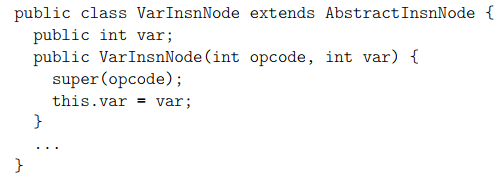

# Tree API (Object Based API)

## 1 Class相关API

### 1.1 接口和组件

#### 1.1.1 基本结构

**核心**：`ClassNode`


<center>Fields of ClassNode</center>

- :warning:图中所有的Field都是**`public`​**的
- :warning:`ClassNode`本身也是继承`ClassVisitor`的
- 除了`version`、`access`、`name`等基本结构外，还包含一些其他的`xxxNode`，这些`xxxNode`和`ClassNode`的关系可以类比`xxxVisitor`和`ClassVisitor`的关系

#### 1.1.2 如何使用Tree API来生成一个类

- **基本方法**：构造`ClasNode`实例、初始化`ClassNode`成员变量。

  ```java
  @Test
  public void testGenClass() {
      ClassNode cn = new ClassNode();
      cn.version = V1_5;
      cn.access = ACC_PUBLIC + ACC_ABSTRACT + ACC_INTERFACE;
      cn.name = "pkg/CnGenClass";
      cn.superName = "java/lang/Object";
      cn.interfaces.add("pkg/MyInterface");
      cn.fields.add(new FieldNode(
          ACC_PUBLIC + ACC_FINAL + ACC_STATIC, "LESS", "I", null, -1
      ));
      cn.fields.add(new FieldNode(
          ACC_PUBLIC + ACC_FINAL + ACC_STATIC, "EQUAL", "I", null, 0
      ));
      cn.fields.add(new FieldNode(
          ACC_PUBLIC + ACC_FINAL + ACC_STATIC, "GREATER", "I", null, 1
      ));
      cn.methods.add(new MethodNode(
          ACC_PUBLIC + ACC_ABSTRACT, "m", "(Ljava/lang/Object;I)I", null, null
      ));
      // 其实最后还是要用到ClassWriter
      ClassWriter cw = new ClassWriter(0);
      cn.accept(cw);
      Util.writeByteInto(cw.toByteArray(), "output/CnGenClass.class");
  }
  ```

- `ClassNode`构造一个类平均会比Core API多花费30%的时间，并且会占用更多的内存。

#### 1.1.3 添加或删除类的成员

Tree API进行类转换的特点：

- 需要遍历数组进行响应操作 &rArr; 消耗更长的时间

- 操作时需要同时保存所有的程序元素 &rArr; 占用更多内存

- 不需要按照既定的顺序访问代码元素 &rArr; 使部分操作可行化（比如添加一个带有数字签名的注解）

- 一般在“**不能使用Core API在一轮（one pass）代码访问中完成类变换**”时，使用Tree API能够大大降低代码实现的复杂度，并具有类似的效率:rainbow:

  > The conclusion is that the tree API is generally used for transformations that *cannot be implemented in one pass with the core API*.   

自定义类转换器模板：

```java
public abstract class ClassTransformer {
    protected ClassTransformer ct;
    public ClassTransformer(ClassTransformer ct) {
        this.ct = ct;
    }
    public void transform(ClassNode cn) {
        if(ct != null)
            ct.transform(cn);
    }
}
```

方法删除器：

```java
public class RemoveMethodTransformer extends ClassTransformer {
    private final String methodName;
    private final String methodDesc;
    public RemoveMethodTransformer(ClassTransformer ct, String methodName, String methodDesc) {
        super(ct);
        this.methodName = methodName;
        this.methodDesc = methodDesc;
    }
    @Override
    public void transform(ClassNode cn) {
		// 这里对列表中所有的方法进行遍历，找到指定方法并删除
        cn.methods.removeIf((mn) -> methodName.equals(mn.name) && methodDesc.equals(mn.desc));
        super.transform(cn);
    }
}
```

成员变量添加器：

```java
public class AddFieldTransformer extends ClassTransformer {
    private final int fieldAccess;
    private final String fieldName;
    private final String fieldDesc;
    public AddFieldTransformer(ClassTransformer ct, int fieldAccess, String fieldName, String fieldDesc) {
        super(ct);
        this.fieldAccess = fieldAccess;
        this.fieldName = fieldName;
        this.fieldDesc = fieldDesc;
    }
    @Override
    public void transform(ClassNode cn) {
        boolean isPresent = false;
        for (FieldNode fn : cn.fields)
            if (fieldName.equals(fn.name)) {
                isPresent = true;
                break;
            }
        if(!isPresent)
            cn.fields.add(new FieldNode(fieldAccess, fieldName, fieldDesc, null, null));
        super.transform(cn);
    }
```

### 1.2 整合Core和Tree

#### 1.2.1  基本表示

`ClassNode`继承了`ClassVisitor`，提供了一个`accept`方法：

- `accept`：生成域值:question:
- `Classvisitor.method`：`ClassVisitor`提供的方法用于设置获取到的事件的域值:question:

##### 从字节数组构造`ClassNode`

```java
ClassNode cn = new ClassNode();
ClassReader cr = new ClassReader(....读取到的字节数组...);
// ClassNode消费ClassReader解析得出的字节码
cr.accept(cn, 0);
```

##### 将`ClassNode`转化成字节数组

```java
ClassNode cn = new ClassNode();
ClassWriter cw = new ClassWriter(0);
// ClassWriter消费ClassNode生成的事件序列
cn.accept(cw);
byte[] bytes = cw.toByteArray();
```

#### 1.2.2 代码模板

##### 基本写法：`ClassReader` &rarr; `ClassNode`  &rarr;  `ClassWriter`

```java
ClassReader cr = new ClassReader(...读入的字节码...);
ClassNode cn = new ClassNode(ASM4);
ClassWriter cw = new ClassWriter(0);
// cr将读入的字节码交给cn；cn会根据这些字节码构造类的结构（也就是初始化自己的fields）
cr.accept(cn, 0);
/*
添加一些变换操作，一般内置在自定义的cn中
*/
// cn将构造好的字节码转换成事件序列，传送给cw；cw会将事件序列转换成字节码；
cn.accept(cw);
```

##### 模板1：使用继承

```java
public class MyClassAdapter extends ClassNode {
    public MyClassAdapter(ClassVisitor cv) {
        super(ASM4);
        this.cv = cv;
    }
    @Override
    public void visitEnd() {
        /*
         调用MyClassAdapter继承的ClassNode方法对代码进行转换。在这个部分MyClassAdapter已经被一个ClassVisitor实accept了
        */
        // 将转换完的字节码结构转化成序列，交付转换链的下一节处理
        accept(cv); 
    }
}
```

采用上述实现，则可以通过下列代码完成对字节码的操作：

```java
ClassWriter cw = new ClassWriter(0);
ClassVisitor ca = new MyClassAdapter(cw);
ClassReader cr = new ClassReader(...读入字节数组...);
/*
与模板的区别在于：
1.将变换代码写在内部；
2.隐藏了一个accept。
*/
cr.accept(ca, 0);
```

##### 模板2：使用委托

```java
public class MyClassAdapter extends ClassVisitor {
    ClassVisitor next;
    public MyClassAdapter(ClassVisitor cv) {
        super(ASM4, new ClassNode());
        next = cv;
    }
    public void visitEnd() {
        ClassNode cn = (ClassNode) cv; // Received events are used to construct a ClassNode
        /*
        调用ClassNode的API进行一些代码变换
        */
        cn.accept(next);
    }
}
```


## 2 Method相关API

### 2.1 接口和组件

#### 2.1.1 基本结构

##### 核心：`MethodNode`


<center>Fields of MethodNode</center>

- `MethodNode`类的成员变量和`ClassNode`类似；
- **重点关注**从`instructions`~`maxLocals`间的左右成员变量，这些成员变量和字节指令有关。

##### 指令列表`InsnList`：


<center>InsnList内部结构</center>

- `InsnList`是一个用于存放指令的链表结构
- 链接关系存储在`AbstractInsnNode`对象中
- `InsnList`的组织结构决定了它的使用方式：
  1. 一个`AbstractInsnNode`对象在一个指令列表中**至多**出现一次
  2. 一个`AbstractInsnNode`对象**不能**同时出现在**多个**指令列表中
  3. （由于1&2）添加`AbstractInsnNode`对象到一个队列时必须要**先**将其**从原来的队列中移除**
  4. （由于1&2）列表之间不存在**复制**，只存在**剪切**（赋值整个列表导致源列表的清空）。

##### 字节指令之源：`AbstractInsnNode`


<center>AbstractInsnNode内部结构</center>

- `AbastractInsnNode`是表示各种指令的数据结构的父类

- `XxxInsnNode`就对应core的`visitXxx`方法，并且构建方法类似。

  

  <center>VarInsnNode的内部结构</center>

- 非指令结构，如lineNum、label、frames，由于会出现在字节码指令序列中，因此ASM也提供了相应的类表示它们，即`LineNumberNode`、`LabelNode`和`FrameNode`。可以通过`getNext()`方法获取这些**非指令**标签后面紧跟着的语句（例如：方便定位`jump`跳转到的位置）

  > It is therefore easy to find the target of a jump instruction, with the getNext method provided by the AbstractInsnNode class: this is the first AbstractInsnNode after the target label that is a real instruction.  

#### 2.1.2 生成方法的字节码

基本形式：向`InsnList`中添加指令对象

```java
MethodNode mn = new MethodNode(...);
InsnList il = mn.instructions;
il.add(new VarInsnNode(ILOAD, 1));
LabelNode label = new LabelNode();
il.add(new JumpInsnNode(IFLT, label));
il.add(new VarInsnNode(ALOAD, 0));
il.add(new VarInsnNode(ILOAD, 1));
il.add(new FieldInsnNode(PUTFIELD, "pkg/Bean", "f", "I"));
LabelNode end = new LabelNode();
il.add(new JumpInsnNode(GOTO, end));
il.add(label);
il.add(new FrameNode(F_SAME, 0, null, 0, null));
il.add(new TypeInsnNode(NEW, "java/lang/IllegalArgumentException"));
il.add(new InsnNode(DUP));
il.add(new MethodInsnNode(INVOKESPECIAL,
"java/lang/IllegalArgumentException", "<init>", "()V"));
il.add(new InsnNode(ATHROW));
il.add(end);
il.add(new FrameNode(F_SAME, 0, null, 0, null));
il.add(new InsnNode(RETURN));
mn.maxStack = 2;
mn.maxLocals = 2;
```

#### 2.1.3 转化方法的字节码

一般来说，使用Tree API进行字节码转换可以采用任意顺序，通常都是基于**遍历**的操作。习惯上，根据变换目标的不同（删除或添加若干指令）可以采用两种不同的模式：

- **删除若干条指令**：
  - 使用`InsnList`返回的`ListIterator`，该迭代器将支持许多并发（:question:Conccurent​）的列表修改操作
  - 利用`InsnList`提供的成员方法，能够移除当前指令或下一条指令之后的若干指令
- **添加若干条指令**：
  - 构建一个临时的`InsnList`实例，将要添加的指令添加到`InsnList`中
  - 调用目标指令队列的`insert`方法，将临时`InsnList`实例加到目标下标`i`后面（这样做的好处是不需要频繁更改下标）

下列代码使用tree API实现添加方法计时器的功能时就用了**添加**模板：

```java
public class AddTimerTransformer extends ClassTransformer {
    public AddTimerTransformer(ClassTransformer ct) {
        super(ct);
    }
    @Override
    public void transform(ClassNode cn) {
        // 添加timer这个field
        int acc = ACC_PRIVATE + ACC_STATIC;
        cn.fields.add(new FieldNode(acc, "timer", "J", null, null));
        // 修改方法的指令构成
        for (MethodNode mn : cn.methods) {
            // 构造方法不用插入time counter
            if("<init>".equals(mn.name) || "<clinit>".equals(mn.name))
                continue;
            InsnList insns = mn.instructions;
            // 空方法不需要插入time counter
            if(insns.size() == 0)
                continue;
            // 遍历所有字节码指令并操作，先添加结尾的四条指令，这样可以少遍历几条指令
            ListIterator<AbstractInsnNode> ite = insns.iterator();
            while(ite.hasNext()) {
                AbstractInsnNode in = ite.next();
                int op = in.getOpcode(); // 记录操作码
                // 返回或异常语句
                if((op >= IRETURN && op <= RETURN) || (op == ATHROW)) {
                    // 生成临时指令队列
                    InsnList ilTemp = new InsnList();
                    // 设置队列，添加需要增加的指令序列
                    ilTemp.add(new FieldInsnNode(GETSTATIC, cn.name, "timer", "J"));
                    ilTemp.add(new MethodInsnNode(INVOKESTATIC, "java/lang/System", "currentTimeMillis", "()J"));
                    ilTemp.add(new InsnNode(LADD));
                    ilTemp.add(new FieldInsnNode(PUTSTATIC, cn.name, "timer", "J"));
                    // 设置完毕之后，将指令序列添加到当前指令之前
                    insns.insert(in.getPrevious(), ilTemp);
                }
            }
            // 添加开头的四条语句
            InsnList ilTemp = new InsnList();
            ilTemp.add(new FieldInsnNode(GETSTATIC, cn.name, "timer", "J"));
            ilTemp.add(new MethodInsnNode(INVOKESTATIC, "java/lang/System", "currentTimeMillis", "()J"));
            ilTemp.add(new InsnNode(LSUB));
            ilTemp.add(new FieldInsnNode(PUTSTATIC, cn.name, "timer", "J"));
        }
        super.transform(cn);
    }
}
```

下面的代码使用tree API完成了删除目标字节码中自我赋值操作的功能，使用到了**删除**模板。本处展示`RemoveSelfAssignTransformer`的优化版本：

```java
public class RemoveSelfAssignTransformer1 extends MethodTransformer {
    public RemoveSelfAssignTransformer1(MethodTransformer mt) {
        super(mt);
    }

    private static boolean isALOAD0(AbstractInsnNode ain) {
        return (ain.getOpcode() == ALOAD) && (((VarInsnNode) ain).var == 0);
    }
    private static boolean sameField(AbstractInsnNode ain1, AbstractInsnNode ain2) {
        return ((FieldInsnNode) ain1).name.equals(((FieldInsnNode) ain2).name);
    }

    /**
     * This method have side-effect. It will move the iterator towards the tail of
     * the list.
     * 
     * @param iter Iterator of an AbstractInsnNode List
     * @return null when no expected instruction were found
     */
    private static AbstractInsnNode getNext(Iterator<AbstractInsnNode> iter) {
        while(iter.hasNext()) {
            AbstractInsnNode ins = iter.next();
            if(!(ins instanceof LineNumberNode))
                return ins;
        }
        return null;
    }
    @Override
    public void transform(MethodNode mn) { // 这个transform估计也能使用状态机方法完成
        InsnList insns = mn.instructions;
        ListIterator<AbstractInsnNode> iter = insns.iterator();
        while(iter.hasNext()) {
            AbstractInsnNode ins1 = iter.next();
            // 通过if-else语句来记录状态
            if(isALOAD0(ins1)) {
                AbstractInsnNode ins2 = getNext(iter);
                if(ins2 != null && isALOAD0(ins2)) {
                    AbstractInsnNode ins3 = getNext(iter);
                    // 处理连续3个ALOAD_0的情况
                    if(ins3 != null && isALOAD0(ins3)) {
                        ins3 = ins2;
                        ins2 = ins3;
                        ins3 = getNext(iter);
                    }
                    if(ins3 != null && ins3.getOpcode() == GETFIELD) {
                        AbstractInsnNode ins4 = getNext(iter);
                        if(ins4 != null && ins4.getOpcode() == PUTFIELD) {
                            if(sameField(ins3, ins4)) {
                                // 修改了getNext方法之后这里的循环就可以省略
                                insns.remove(ins1);
                                insns.remove(ins2);
                                insns.remove(ins3);
                                insns.remove(ins4);
                            }
                        }
                    }
                }
            }
        }
        super.transform(mn);
    }
}
```

#### :star2:2.1.4 Global Transformations

Tree API相对于Core API，可以方便地修改距离当前指令任意距离的其他指令。例如如下需求：修改目标字节码指令中所有的`Jump`指令，简化程序的控制流结构、提高程序的运行效率：

```java
public class OptimizeJumpTransformer extends MethodTransformer {
    public OptimizeJumpTransformer(MethodTransformer mt) {
        super(mt);
    }

    @Override
    public void transform(MethodNode mn) {
        InsnList insns = mn.instructions;
        Iterator<AbstractInsnNode> ite = insns.iterator();
        while(ite.hasNext()) {
            AbstractInsnNode in = ite.next();
            if(in instanceof JumpInsnNode) {
                // 获取Jump指令的目标Label
                LabelNode label = ((JumpInsnNode) in).label;
                AbstractInsnNode target;
                // 当target表示的指令为goto l时，将其替换成goto label
                while(true) {
                    target = label; // 从goto的目的地开始进行迭代
                    while(target != null && target.getOpcode() < 0) // 不表示实际指令的指令节点的opcode为负数
                        target = target.getNext(); 

                    if(target != null && target.getOpcode() == GOTO)
                        label = ((JumpInsnNode) target).label;
                    else
                        break;
                }
                // update target。就是能跳转的到最后一个Label
                ((JumpInsnNode) in).label = label;
                // 如果可能的话，直接将Jump语句替换成目标语句
                int op = target.getOpcode(); // 这个地方有可能为null，怎么处理？
                if((op >= IRETURN && op <= RETURN) || op == ATHROW) // 如果跳转到的语句是方法的最后一句，那么直接将jump修改成这条结束语句
                    insns.set(in, target.clone(null)); // Target该是一个结束语句
            }
        }
        super.transform(mn);
    }
}
```

对`Bean.class`文件的字节码指令进行优化，优化前后对比如下：


<center>优化前后对比</center>

`IFLT L1`也有`GOTO`的作用，但是上述代码的优化只对`GOTO`起作用。


### 2.2 组合Core和Tree API

#### 2.2.1 基本结构

- `MethodNode`继承了`MethodVisitor`，可以覆写`visit*`方法
- 提供了两个`accept`方法，分别用于接收`MethodVisitor`和`ClassVisitor`
- `accept`方法可以将`MethodNode`表示的程序元素转化成事件序列；`MethodVisitor`方法则可以调整这些事件，完成预期更改。

#### 2.2.2 编写模式

##### 模式1：基于继承的写法：

```java
public class MyMethodAdapter extends MethodNode {
    public MyMethodAdapter(int access, String name, String desc, String signature, String[] exceptions, MethodVisitor mv) {
        super(ASM4, access, name, desc, signature, exceptions);
        this.mv = mv;
    }
    @Override 
    public void visitEnd() {
        // put your transformation code here
        accept(mv);
    }
}
```

模式1变形：在`ClassAdapter`的`visitMethod`方法中返回一个匿名内部类

```java
public MethodVisitor visitMethod(int access, String name, String desc, String signature, String[] exceptions) {
    return new MethodNode(ASM4, access, name, desc, signature, exceptions) {
        @Override public void visitEnd() {
            // put your transformation code here
            accept(cv);
        }
    };
}
```

##### 模式2：基于委托的写法：

```java
public class MyMethodAdapter extends MethodVisitor {
    MethodVisitor next;
    public MyMethodAdapter(int access, String name, String desc, String signature, String[] exceptions, MethodVisitor mv) {
        super(ASM4, new MethodNode(access, name, desc, signature, exceptions));
        next = mv;
    }
    @Override public void visitEnd() {
        MethodNode mn = (MethodNode) mv;
        // put your transformation code here
        mn.accept(next);
    }
}
```


## :star:3 Method Analysis - 使用Tree API进行程序分析

### 3.1 概况

- 现存有大量程序分析相关的算法，这里不能全部展示 &rArr; 以这里给出的程序分析实现为例，通过**程序分析算法 + ASM**的形式可以实现各种程序分析功能。
- 介绍程序分析的概况，详述**数据流分析**和**控制流分析**算法的实现过程


##### **数据流分析**

计算每一条指令的执行结果对execution frame状态（state）的影响，有两种数据流分析的形式：

- **前向分析（Forward Analysis）**：以指令执行**前**的frame状态为起点，计算每一条指令执行之**后**的frame的状态；前向分析需要模拟字节指令的执行过程，修改执行框（execution frame）的状态。
  - 模拟操作基本包括：
    - 从（操作数）栈中弹出值；
    - 连接（计算）（被弹出的）值；
    - 将运算结果压栈。
  - 静态程序分析的目的是模拟**所有潜在的执行路径**，找到所有可能的参数值。这是与Java虚拟机的工作最显著的区别
    - 计算出的结果**不是单个值**，一般是**可能值的集合**
    - 结果集的**并**（Union）和**交**（Intersection）
- **后向分析（Backward Analysis）**：以指令执行**后**的frame状态为起点，起算每一条指令执行之**前**的frame的状态；

##### **控制流分析**

计算程序的控制流图

- 控制流图的**节点**是**指令**（:question:应该可以按需替换成基本块​？）
- 从*i* &rarr; *j*的有向边（oriented edge）代表指令*j***可能**在*i*后面执行


<center>checkAndSetF方法的控制流图</center>

- 图示控制流图是以基本块为节点，文档中关于基本块的定义如下：

  > ...a *basic block* being a sequence of instructions such that each instruction except the last one has exactly one successor, and such that no instruction except the first one can be the target of a jump.  

  在一个基本块中，除最后一条指令（出口点）之外，其他指令只能有**一个**出口；只有第一条指令可以作为`Jump`类指令的目标（这解释了为什么*end*: `RETURN`单独成一个基本块）。

### 3.2 接口和组件

`org.objectweb.asm.tree.analysis  `：ASM提供了做前向数据流分析的tree API，数据流分析API分成两部分

1. **固定部分**。包括数据流分析算法的框架、模拟的压栈和出站操作、结果值的近似。这些操作由`Analyzer`和`Frame`类集中实现；
2. **用户自定义部分**。包括数据值的计算、结果集的交和并。用户可以通过自定义生成`Interpreter`和`Value`的子类实现这些功能。

#### 3.2.1 基本数据流分析

`BasicInterpreter`是一个预先定义好的、抽象类`Interpreter`的子类，给出了7种用于模拟字节指令执行结果数值集（这7种是不是和类型系统中的7种类型相对应呢？）：

1. `UNINITIALIZED_VALUE`：所有可能值的集合；
2. `INT_VALUE`：所有`int`、`short`、`byte`、`boolean`、`char`值的集合；
3. `FLOAT_VALUE`：所有`float`值的集合；
4. `LONG_VALUE`：所有`long`值的集合；
5. `DOUBLE_VALUE`：所有`double`值的集合；
6. `REFERENCE_VALUE`：所有对象和数组值的集合；
7. `RETURNADDRESS_VALUE`：处理与子程序（:question:或者是子进程​）相关的问题。

`BasicInterpreter`本身能做的事情有限，但是能够帮助构造`Analyzer`实例，能够实现部分简单功能，例如：死代码（Dead Code）的检测与移除：

```java
public class RemoveDeadCodeAdapter extends MethodVisitor {
    String owner;
    MethodVisitor next;
    public RemoveDeadCodeAdapter(String owner, int access, String name, String desc, MethodVisitor next) {
        super(ASM4, new MethodNode(access, name, desc, null, null));
        this.owner = owner;
        this.next = next;
    }
    public RemoveDeadCodeAdapter(MethodNode mn, MethodVisitor next, String owner) {
        super(ASM4, mn);
        this.owner = owner;
    }
    @Override
    public void visitEnd() {
        MethodNode mn = (MethodNode) mv;
        // 使用BasicInterpreter进行Analyzer的空白实现
        Analyzer<BasicValue> a = new Analyzer<>(new BasicInterpreter());
        try {
            a.analyze(owner, mn);
            // 获得结果
            Frame<BasicValue>[] frames = a.getFrames();
            //
            System.out.println("Frames: " + Arrays.asList(frames));
            //
            AbstractInsnNode[] insns = mn.instructions.toArray();

            for(int i = 0 ; i < frames.length; i++)
                if(frames[i] == null && !(insns[i] instanceof LabelNode))
                    mn.instructions.remove(insns[i]);

        } catch (AnalyzerException e) {
            e.getStackTrace();
        }
        mn.accept(next);
    }
}

// 放到ClassVisitor中
public class RemoveDeadCodeClassAdapter extends ClassVisitor {
    String owner;
    public RemoveDeadCodeClassAdapter(ClassVisitor classVisitor, String owner) {
        super(ASM4, classVisitor);
        this.owner = owner;
    }
    @Override
    public MethodVisitor visitMethod(int access, String name, String descriptor, String signature, String[] exceptions) {
        MethodVisitor mv = super.visitMethod(access, name, descriptor, signature, exceptions);
        if(mv != null)
            return new RemoveDeadCodeAdapter(owner, access, name, descriptor, mv);
        return null;
    }
}

// 进行死代码移除
@Test
public void testRemoveDeadCode() {
    String inPath = "output/OptimizedBean.class";
    String outPath = "output/RemoveDCFromOBean.class";
    byte[] bytes = Util.readBytesFrom(inPath);
    ClassReader cr = new ClassReader(bytes);
    ClassWriter cw = new ClassWriter(0);
    ClassVisitor cv = new RemoveDeadCodeClassAdapter(cw, "Bean");
    cr.accept(cv, 0);
    Util.writeByteInto(cw.toByteArray(), outPath);
}
```

在移除了目标字节码中的死代码之后，通过反编译拿到的代码还是**不变的**。这说明，一套源代码可能可以编译成为效率不同、但是功能相同的字节指令序列。

#### 3.2.2 基本数据流验证

`BasicVerifier`和`BasicInterpreter`一样，都包含7种类型的结果集。`BasicVerifier`的一般用于验证字节指令的正确性，比如它可以检测出类似`ISTORE 1`&rarr;`ALOAD 1`这种不正确的指令序列。实际的工作效果和`CheckMethodAdapter`类似。

```java
public class BasicVerifierAdapter extends MethodVisitor {
    String owner;
    MethodVisitor next;
    public BasicVerifierAdapter(String owner, int access, String name, String desc, MethodVisitor next) {
        // 所以这里使用owner、access、name、desc等参数构造了一个MethodNode，而MethodNode正好是MethodVisitor的子类
        super(ASM4, new MethodNode(access, name, desc, null, null));
        this.owner = owner;
        this.next = next;
    }
    @Override
    public void visitEnd() {
        // 这个mv继承自MethodVisitor；这个mv的初始化从何而来？
        MethodNode mn = (MethodNode) mv;
        // Analyzer初始化时，需要传入一个Interpreter实例
        Analyzer<BasicValue> a = new Analyzer<>(new BasicVerifier());
        try {
            a.analyze(owner, mn);
        } catch (AnalyzerException e) {
            // 为啥这里catch之后又自己抛了一个？
            throw new RuntimeException(e.getMessage());
        }
        mn.accept(next); // 将mn表示的字节指令转换成事件序列。
    }
}
```

#### 3.2.3 简单数据流验证（器）

检测（并删除）代码中存在的冗余类型转换，例如下图：


强制类型转换一般是在编程人员确定的前提下，将一个父类型实例转化成一个子类型。因此，从子类型到父类型的类型转换是对于的。

使用ASM对字节指令进行分析时，针对的是指令`CHECKCAST`

```java
public class RemoveUnusedCastTransformer extends MethodTransformer {
    String owner;
    public RemoveUnusedCastTransformer(MethodTransformer mt, String owner) {
        super(mt);
        this.owner = owner;
    }
    private static Class<?> getClass(String desc) {
        try {
            return Class.forName(desc.replace('/', '.'));
        } catch (ClassNotFoundException e) {
            throw new RuntimeException(e.toString());
        }
    }
    private static Class<?> getClass(Type type) {
        if (type.getSort() == Type.OBJECT)
            return getClass(type.getInternalName());
        return getClass(type.getDescriptor());
    }  
    // implement for java 6-
    @Override
    public void transform(MethodNode mn) {
        Analyzer<BasicValue> analyzer = new Analyzer<>(new SimpleVerifier());
        try {
            analyzer.analyze(owner, mn);
            Frame<BasicValue>[] frames = analyzer.getFrames();
            AbstractInsnNode[] insns = mn.instructions.toArray();
            for(int i = 0 ; i < insns.length; i++) {
                AbstractInsnNode insn = insns[i];
                if(insn.getOpcode() == CHECKCAST) {
                    Frame<BasicValue> frame = frames[i];
                    if(frame != null && frame.getStackSize() > 0) {
                        BasicValue operand = frame.getStack(frame.getStackSize() - 1);
                        Class<?> to = getClass(((TypeInsnNode) insn).desc);
                        Class<?> from = getClass(operand.getType());
                        if(to.isAssignableFrom(from)) // from类型可以直接赋值给to类型，说明from类型是to类型的子类型
                            mn.instructions.remove(insn);
                    }
                }
            }
        } catch (AnalyzerException e) {
            e.printStackTrace();
        }
    }
}
```

#### :star2:3.2.4 自定义数据流分析

**目标**：分析程序中可能存在的`NullPointerException`

- 确定取值范围：`{NULL, NONNULL, MAYBENULL}`

  - 取值范围中的三个元素对应三个取值**集合**

- 将指令与取值相关联

  - `ACONST_NULL` &rArr; `NULL`
  - 其他加载引用的指令 &rArr; `NONNULL`
    - 这是在不做global analysis的前提下能办到的最好情况。global analysis需要分析一个程序涉及到的所有类。
  - 结果集为`NULL`和`NONNULL`的两个基本块的Union操作 &rArr; `MAYBENULL`

- 在`BasicInterpreter`的基础上实现一个`IsNullInterpreter`解释器

  - 使用`BasicInterpreter`中的`REFERENCE_VALUE`作为`NONNULL`；分别生成两个`BasicValue`实例来表示`NULL`和`MAYBENULL`
  - 实现用于模拟虚拟机操作的方法
    1. `newOperation`：模拟压栈操作
    2. `merge`：模拟Union操作

  ```java
  public class IsNullInterpreter extends BasicInterpreter {
      public final static BasicValue NULL = new BasicValue(null);
      public final static BasicValue MAYBENULL = new BasicValue(null);
      public IsNullInterpreter() {
          super(ASM4);
      }
      // 模拟压栈操作
      @Override
      public BasicValue newOperation(AbstractInsnNode insn) throws AnalyzerException {
          if(insn.getOpcode() == ACONST_NULL)
              return NULL;
          return super.newOperation(insn);
      }
      // Union操作
      @Override
      public BasicValue merge(BasicValue value1, BasicValue value2) {
          if(isRef(value1) && isRef(value2))
              return MAYBENULL;
          return super.merge(value1, value2);
      }
      // 只要是Ref的值就返回true
      private static boolean isRef(Value value) {
          return value == REFERENCE_VALUE || value == NULL || value == MAYBENULL;
      }
  }
  ```

- 实现`NullDereferenceAnalyzer`，用于检测可能导致潜在空指针异常的指令

#### :star2:3.2.5 自定义控制流分析

**目标**：计算圈复杂度（cyclomatic complexity）

- 圈复杂度能够从一定程度上表征一个方法的“复杂性”，通常和方法中潜在的bug有关；
- 圈复杂度可以帮助测试人员确定某个方法所需的测试方法的**个数**。

实现计算圈复杂度功能的过程分为以下几步：

- 为了构建控制流图，首先要有CFG的节点`Node`，`Node`建立在ASM提供的`Frame`的基础上：

```java
public class Node<V extends Value> extends Frame<V> {
    Set<Node<V>> successors = new HashSet<>(); // 后继结点
    // 实现2个constructor，其余不变
    public Node(int nLocals, int nStack) {
        super(nLocals, nStack);
    }
    public Node(Frame<? extends V> src) {
        super(src);
    }
}
```

- 提供自定义的`Analyzer`的子类，利用这个子类构建CFG并进一步计算圈复杂度：

```java
public class MyAnalyzer extends Analyzer<BasicValue> {

    public MyAnalyzer(Interpreter<BasicValue> interpreter) {
        super(interpreter);
    }
    // 将CFG的节点替换成我们自定义的节点，不使用原生的Frame
    @Override
    protected Frame<BasicValue> newFrame(int nLocals, int nStack) {
        return new Node<>(nLocals, nStack);
    }
    @Override
    protected Frame<BasicValue> newFrame(Frame<? extends BasicValue> frame) {
        return new Node<>(frame);
    }
    @Override
    protected void newControlFlowEdge(int src, int dst) { // 新建一条从src -> dst的边
        Node<BasicValue> s = (Node<BasicValue>) getFrames()[src];
        s.successors.add((Node<BasicValue>) getFrames()[dst]);
    }
}
```


- 提供计算圈复杂度的逻辑
```java
public class CyclomaticComplexity {
    public static void computeCCForClass(ClassNode cn) throws AnalyzerException {
        String owner = cn.name;
        List<MethodNode> methodNodes = cn.methods;
        for (MethodNode mn : methodNodes) {
            System.out.println(mn.name + ": " + getCyclomaticComplexity(owner, mn));
        }
    }

    public static int getCyclomaticComplexity(String owner, MethodNode mn) throws AnalyzerException {
        Analyzer<BasicValue> analyzer = new MyAnalyzer(new BasicInterpreter());
        analyzer.analyze(owner, mn);
        // 这里的Frame应该是Node
        Frame<BasicValue>[] frames = analyzer.getFrames();
        int edges = 0; // 记录边数
        int nodes = 0; // 记录点数
        for(int i = 0 ; i < frames.length; i++) {
            if(frames[i] != null) {
                edges += ((Node<BasicValue>)frames[i]).successors.size();
                nodes += 1;
            }
        }
        return edges - nodes + 2; // 计算圈复杂度
    }
}
```


## 4 Metadata相关API

说的比较简单，需要用的时候再看文档。


## 5 向后兼容指导

Class Generator：不需要遵循任何规则，可以按照逻辑任意创建

Class Analyzer & Class Adapter：存在一系列调用链，为了保持版本一致，需要遵循一定的规则。

### 5.1 基本法则

#### 指导1：当创建一个`ClassNode`时，确保ASM API版本和`ClassNode`表示的Class文件的版本一致。

目的：避免非对应版本中的未知特性。这些未知特性可能会导致分析失败，或者是分析出现错误。

#### 指导2：当使用他人创建的`ClassNode`时，调用这个`ClassNode`的`check()`方法，并以自己采用的ASM版本号为参数传入，已检查是否兼容。

目的：同指导1一样。

#### 总结：在继承ASM框架提供的各种类以自定义程序分析时，最好将api版本作为参数传入

