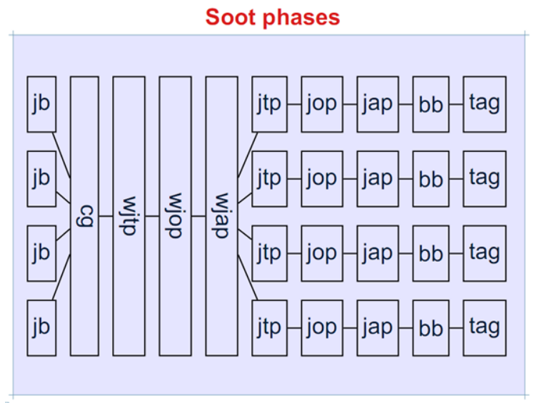

## Pack和Phase

- 图中的“j”指的都是中间表示Jimple。说明Jimple是soot程序分析的基础；
- Baf是一种基于栈的中间表示，Soot将利用Baf生成字节码；
- 基本工作流程：构建Jimple &rArr; 构建调用图 &rArr; 全局变换 &rArr; 全局优化 &rArr; 全局注解（可能对应插桩？） &rArr; 局部变换 &rArr; 局部优化 &rArr; 局部注解 &rArr; 生成Baf中间表示（BB）；
- Shimple：SSA variant of Soot's Jimple，Soot提供的、符合Static Single Assignment要求的中间表示。